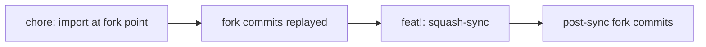

# Reshape fork history into a linear import plus squash-sync

## Release Recommendation

**Release:** ship independently

Repo-level history rewrite, `scripts/upstream-sync.sh`, and `docs/upstream-sync.md`.
No package roadmap step references this fork issue.
`scripts/release/next-version.sh` still refuses every package because the fork has zero tags.

Do not dispatch `release.yml` after this lands.
Issue [#3] is the first publish of `@jopqior/pi-subagents` and must wait until this force-push has finished.

## Problem Statement

The first upstream sync ([#2]) used a real merge (`2d8cea69`).
Default `git log` and GitHub's commit list walk that merge's second parent into thousands of upstream commits, so the fork's own work is unreadable.

Measured on current `main`: 5881 commits total, 37 of them authored by Jopqior (0.6%).
The other authors on `git log --first-parent` of the merge are Chris Lasher, bots, and earlier contributors.

The issue already rejected "leave history, filter the view" (`--first-parent` / `?author=`) because that does not fix the default view.
It also rejected "only change future syncs" because the existing merge would keep drowning the log.

The rewrite has to land before [#3] tags `pi-subagents-v1.0.0`.
The window is still open: zero tags, only local branch `main`, zero PRs, `main...origin/main` is `0 0`, no branch protection.

## Goals

- Replace the current history with a fully linear first-parent chain: one orphan import root, the fork commits replayed with identical trees, one single-parent squash-sync in place of `2d8cea69`, then every commit that is currently on `2d8cea69..HEAD`.
- Preserve the pre-reshape `HEAD` tree byte-for-byte (`git diff` empty) before any later docs/script edits.
- Force-push `origin main` once with `--force-with-lease` after the script and handbook land on the new history.
- Change `scripts/upstream-sync.sh --merge` (real merge) into `--sync` (squash-sync): synthetic ancestor, single-parent commit, type derived from `old..new`, conflict recipes, `refs/sync/upstream-main` as the base pointer.
- Update `docs/upstream-sync.md`, `README.md`, and `AGENTS.md` for the new history layout and the new command.

This is not a package breaking change.
No `@jopqior/*` package has been published.
Existing clones of this fork need `git fetch origin && git reset --hard origin/main` after the force-push; that is an accepted residual of the rewrite.

## Non-Goals

- [#3] npm scope rename, Trusted Publisher, or the 1.0.0 first publish.
- [#4] `@jopqior/pi-subagents-model-selector` first publish.
- A bash test harness (same deferral as [#2] and [#5]).
- Pushing `refs/sync/upstream-main` to origin (local-only; recovery is documented).
- Any edit to `scripts/release/*`, `cliff.toml`, or `committed.toml`.
- Rewriting SHAs inside historical plans or retros (`docs/plans/f0002-*.md`, `docs/retro/f0002-*.md` keep `2d8cea69` as narrative).
- Two-parent sync commits (that would restore the default-log drowning this issue exists to remove).
- `git filter-repo`, `git rebase -i`, or `git merge upstream/main` on `main`.
- Making GitHub's ahead/behind against the parent repository meaningful again.

## Background

Author is the operator; the issue body is the working hypothesis.
`ask_user` is skipped: the three rejected alternatives and the squash-sync shape are already decided in the issue.
Tidy-First is skipped: no `src/` or `test/` files.
Design-review is skipped: no shared TypeScript interface or layer wiring.

[#2] landed `scripts/upstream-sync.sh` (fetch default, `--merge` opt-in, never push, never import tags) and the real merge `2d8cea69`.
[#3] is open and blocked on this rewrite remaining tagless.
[#4] is independent.

No open sibling issue or PR touches `scripts/upstream-sync.sh`.
The newest backlog triage is `docs/triage/2026-09-02-backlog.md` and predates this issue.

AGENTS.md constraints that apply:

- Sync only through `scripts/upstream-sync.sh`; never `git fetch --tags` / `git fetch --all --tags` / flagless `git fetch upstream`.
- Split a pushing script from its read-only half — `upstream-sync.sh` still never pushes.
- The one force-push of `main` is this issue's rewrite, not a new capability of the sync script.
- Before that push, verify `origin` is `Jopqior/gotgenes-pi-packages` and name the remote and branch.
- After `upstream` exists, `gh pr list` and `gh issue view` need `--repo Jopqior/gotgenes-pi-packages`.
- Do not `Edit`/`Write` a file that still has conflict markers (`pi-autoformat` joins them).
- Avoid `git rebase -i` in this environment; the reshape uses `git commit-tree`, not rebase.

### Measured window (planning session)

| Fact                                                              | Value                                             |
| ----------------------------------------------------------------- | ------------------------------------------------- |
| `HEAD`                                                            | `7e55552da0373ad651a245b753fe9dc5a64a6638`        |
| Local tags                                                        | 0                                                 |
| Local branches                                                    | `main` only                                       |
| Open PRs                                                          | none                                              |
| `main...origin/main`                                              | `0 0`                                             |
| Branch protection                                                 | none                                              |
| `origin`                                                          | `git@github.com:Jopqior/gotgenes-pi-packages.git` |
| Merge commit                                                      | `2d8cea699b08afa0f6a2c06eeb1507a52d699636`        |
| Merge first parent (fork tip)                                     | `661111ea1ba8c31051b951738241199370c62ab1`        |
| Merge second parent (upstream)                                    | `045213317de608c04a7b6052b2b843e3a0f2176f`        |
| Fork point (`2d8cea69^1` parent of first Jopqior commit)          | `af980a236fd3ff043e3d432336b0f3de540fdd1b`        |
| Fork-point tree                                                   | `d985551dadaac7d5866c352607685ba1053cba60`        |
| `2d8cea69` tree                                                   | `c66fd9c5d20f69dede46a12fdcd2426d7647f26f`        |
| `HEAD` tree                                                       | `c39de579c087e3784127e5973ad658c2ddfce62e`        |
| `git rev-list --reverse af980a23..661111ea`                       | 33 (all Jopqior)                                  |
| `git rev-list --reverse 2d8cea69..HEAD`                           | 3 at planning (grows with this plan and retro)    |
| `git log --author=Jopqior`                                        | 37 (33 + the merge + 3)                           |
| `HEAD...upstream/main`                                            | `37 0` (upstream has not moved)                   |
| Newest upstream `pi-subagents` tag                                | `pi-subagents-v21.7.0`                            |
| Newest `chore(release): pi-subagents` contained in the fork point | 21.5.0 (`e311a0d1`, ancestor of `af980a23`)       |
| Untracked (leave untouched)                                       | `.pi/extensions/pi-permission-system/`            |
| `jq` / `python3` / `git`                                          | jq 1.8.1, python3 present, git 2.53.0             |

The issue's "37 fork commits from the fork point to `2d8cea69`" is the author count on current `HEAD`, not the replay set.
The replay set is `af980a23..2d8cea69^1` (33) plus `2d8cea69..HEAD` (3 now, more by build time).
`2d8cea69` itself is replaced, not replayed.

Re-measure `2d8cea69..HEAD` at the start of the reshape step and use that list.
Do not hard-code "3 docs commits".

### Type of the historical squash (measured)

`git log --format='%s%n%b'` over `af980a23..04521331` (102 commits) contains two `BREAKING CHANGE:` bodies, six `feat` subjects, and ten `fix` subjects.
Derived type: `feat!:`.

## Design Overview

### History shape

Default `git log` after this change must not walk upstream at all.
Every new commit has exactly one parent (the import has zero).



The squash-sync commit is **single-parent**.
A second parent pointing at the upstream SHA would make GitHub and flagless `git log` recurse into upstream again, which is the defect.

The upstream SHA lives in the commit body and in `refs/sync/upstream-main`, not in `git log`'s parent walk.

### One-time reshape (plumbing only)

Do not commit a reshape script into the repo (it would be dangerous after the window closes).
Run a `/tmp` snippet from the build step.

Do not `git rebase --onto` and do not `git cherry-pick`.
Both apply patches and run `commit-msg` / `pre-commit` hooks 33+ times.
Copy trees with `git commit-tree` so each replayed commit's tree OID equals the original.

Preconditions (abort on any failure), using `--repo Jopqior/gotgenes-pi-packages` for `gh`:

1. `git tag -l` is empty.
2. `git branch --list` prints only `main`.
3. `gh pr list --repo Jopqior/gotgenes-pi-packages` is empty.
4. `git rev-list --left-right --count main...origin/main` is `0 0`.
5. Tracked worktree and index are clean (`git diff --quiet && git diff --cached --quiet`).
6. Current branch is `main`.
7. `git remote get-url origin` contains `Jopqior/gotgenes-pi-packages`.
8. No merge or rebase is in progress under `$(git rev-parse --git-dir)`.
9. `2d8cea69` is still an ancestor of `HEAD` and still has two parents.

Then:

```bash
OLD_HEAD=$(git rev-parse HEAD)
git update-ref refs/backup/pre-reshape "$OLD_HEAD"

FORK_POINT=af980a236fd3ff043e3d432336b0f3de540fdd1b
MERGE=2d8cea699b08afa0f6a2c06eeb1507a52d699636
FORK_TIP=$(git rev-parse "$MERGE^1")
UPSTREAM_SYNC=$(git rev-parse "$MERGE^2")
```

Import root (no `-p`):

```text
chore: import gotgenes/pi-packages at af980a23

Upstream: https://github.com/gotgenes/pi-packages
SHA: af980a236fd3ff043e3d432336b0f3de540fdd1b
Baseline: pi-subagents 21.5.0 (e311a0d1eff8ce73db43912b7483cbf15faf0fa3)
```

Tree must equal `af980a23^{tree}`.

Replay each commit in `git rev-list --reverse $FORK_POINT..$FORK_TIP` with the original author name/email/date **and** original committer name/email/date, message from `git log -1 --format=%B`, tree from the original, parent = the previous new commit.
After each copy, `git rev-parse NEW^{tree}` must equal `git rev-parse OLD^{tree}`.

Squash-sync (parent = replayed fork tip, tree = `$MERGE^{tree}`):

```text
feat!: sync gotgenes/pi-packages af980a23..04521331

Upstream: https://github.com/gotgenes/pi-packages
Range: af980a236fd3ff043e3d432336b0f3de540fdd1b..045213317de608c04a7b6052b2b843e3a0f2176f
Baseline: pi-subagents-v21.7.0
```

Subject length is 51 (under `committed.toml`'s 120).
`git commit-tree` bypasses `committed`; keep the subject conventional anyway.

Replay each commit in `git rev-list --reverse $MERGE..$OLD_HEAD` the same way.

Abort **before** `git reset --hard` unless all of these hold:

- `git diff $OLD_HEAD $NEW_HEAD` is empty.
- `git rev-parse $NEW_HEAD^{tree}` equals `git rev-parse $OLD_HEAD^{tree}`.
- `git rev-list --count $NEW_HEAD` equals `1 + N_before + 1 + N_after`.
- `git log --format='%P' $NEW_HEAD` has no line with two parents.
- `git merge-base --is-ancestor $IMPORT $NEW_HEAD`.
- `git tag -l` is still empty.

Then `git reset --hard $NEW_HEAD` (untracked files stay) and:

```bash
git update-ref refs/sync/upstream-main "$UPSTREAM_SYNC"
```

`refs/backup/pre-reshape` stays local so the old graph is recoverable without adding a branch that would fail the "only `main`" window on a retry.

### Squash-sync mechanism (after reshape)

Bare `git merge upstream/main` on `main` is the wrong 3-way: there is no merge-base, and git will refuse unrelated histories (`merge.allowUnrelatedHistories` is unset).
The script must never call that path.
`--merge` is removed; the flag is `--sync`.

Synthetic ancestor (issue primary; conflicts use ordinary `git merge` tools):

1. `U_old=$(git rev-parse refs/sync/upstream-main)`.
2. `U_new=$(git rev-parse upstream/main)`.
3. Refuse unless `U_old` is an ancestor of `U_new`.
4. Refuse if `git rev-list --count $U_old..$U_new` is 0.
5. `SYN=$(git commit-tree $(git rev-parse HEAD^{tree}) -p "$U_old" -m "temp: synthetic squash-sync ancestor")`.
6. `git switch -c sync/in-progress "$SYN"`.
7. `GIT_MERGE_AUTOEDIT=no git merge "$U_new"` (no `--allow-unrelated-histories`).
8. On success, capture `TREE=$(git rev-parse HEAD^{tree})`, `git switch main`, materialize `$TREE` on `main`, commit as a **single-parent** commit with the derived type, delete `sync/in-progress`.
9. On conflict, run the recipes below; if anything remains unmerged, leave the operator on `sync/in-progress` and require `--continue`.

`--continue` reads `$(git rev-parse --git-dir)/upstream-sync-state` (so a worktree is detected), refuses unless the current branch is `sync/in-progress` and no unmerged paths remain, then transplants the tree onto `main` the same way.

`git merge-tree --write-tree --merge-base` is available (git 2.53) but does not put the operator in a normal conflicted merge.
Do not use it for `--sync`.

### Type derivation

Scan `git log --format='%s'` and `git log --format='%b'` over `$U_old..$U_new`.

- Subject matches `^[a-z]+(\([^)]+\))?!:` **or** a body line `^BREAKING CHANGE:` → breaking.
- Subject matches `^feat(\(|:|!)` → feat.
- Subject matches `^fix(\(|:|!)` → fix.

Max:

1. Any breaking → `feat!:` (always `feat!:`, even if the only bang was `fix!:`; git-cliff majors either way).
2. Else any feat → `feat:`.
3. Else any fix → `fix:`.
4. Else `chore:` (`chore` is a visible cliff section and cuts a patch; a skipped type would hide a tree-changing sync).

Read-only flag for the pin:

```bash
./scripts/upstream-sync.sh --derive-type <old> <new>
```

Prints only the type token plus a newline.
Against the historical range this must print `feat!:`.

### Base pointer versus sync log

`refs/sync/upstream-main` is the authority (the last synced upstream SHA).
The Sync log table is the human record.
`--sync` and the read-only default refuse unless both exist and the 40-hex in the ref equals the last Sync log row's Upstream SHA column.

Parse rule (pinned against the current file at planning: `045213317de608c04a7b6052b2b843e3a0f2176f`):

```awk
$0 ~ /^[[:space:]]*\|[[:space:]]*[0-9]{4}-[0-9]{2}-[0-9]{2}T/ {
  gsub(/^[[:space:]]+|[[:space:]]+$/, "", $3)
  sha=$3
}
END { print sha }
```

Field 3 is the Upstream SHA with `FS='|'`.

The ref is local-only.
A fresh clone will not have it; the handbook shows:

```bash
git update-ref refs/sync/upstream-main <Upstream SHA from the last Sync log row>
```

The script still never pushes.

A commit cannot contain its own SHA in its tree, so the Sync log row is a follow-up `docs:` commit (same pattern as [#2] recording `2d8cea69` in `693bbbf8`).
`--sync` creates the squash-sync commit, then a second `docs:` commit that appends the row, including the fork sync SHA of the first commit.
`--continue` does the same.

### Ahead metric

After reshape, `git rev-list --left-right --count HEAD...upstream/main` is unrelated-history noise (all fork commits versus all upstream commits).
Do not print it.

Print instead:

```text
sync base: <U_old>
upstream commits since last sync: <git rev-list --count U_old..upstream/main>
pending sync type: <type or (none)>
newest upstream pi-subagents tag: ...
```

Keep the tag-set guard, `tagOpt=--no-tags`, `pushurl=DISABLE`, and `git fetch --no-tags upstream main`.

### Conflict recipes

Run only on unmerged paths after the synthetic merge.
Anything not in this list stays conflicted and falls through to the handbook.

**`packages/pi-subagents/package.json`** — take stage 3 (theirs), restore `name` and `version` from stage 2 (ours) with `jq`.
Before [#3] those two fields still match upstream, so this is a no-op until the rename.
A sync between this issue and [#3] would freeze `version` at ours (`21.7.0`); [#3] sets `1.0.0` anyway.

**`packages/pi-subagents/CHANGELOG.md`** — section splice, not ours/theirs wholesale:

1. Header = lines before the first `##` in theirs.
2. Fork-only = every `##` section in ours whose heading line is not present in theirs.
3. Result = header + fork-only (ours order) + theirs from its first `##` to EOF.

Worked example after [#3]:

```text
ours:     ## [1.0.0] + ## [21.7.0] + older
theirs:   ## [21.8.0] + ## [21.7.0] + older
result:   ## [1.0.0] + ## [21.8.0] + ## [21.7.0] + older
```

Implement the splice in `python3` (stdlib) inside the script.

**`pnpm-lock.yaml`** — always `pnpm install` from the repo root after the sync tree is materialized, even when git reports zero markers, then `git add pnpm-lock.yaml`.

If the sync renamed files, `find .rumdl_cache -type f -delete`.

### CLI

```text
scripts/upstream-sync.sh
scripts/upstream-sync.sh --sync
scripts/upstream-sync.sh --continue
scripts/upstream-sync.sh --derive-type <old> <new>
```

`--merge` exits 2 with `use --sync; squash-sync replaced merge`.
`--sync` keeps every current `--merge` precondition (branch `main`, origin is this fork, clean tracked tree, no merge/rebase in progress) plus: `refs/sync/upstream-main` exists, matches the table, and is an ancestor of `upstream/main`.
The script never pushes.
`--continue` is the only mutating path allowed off `main` (it must start on `sync/in-progress` and finish on `main`).

### Consumer sketch (`--sync` success path)

```bash
U_old=$(git rev-parse refs/sync/upstream-main)
SYN=$(git commit-tree "$(git rev-parse HEAD^{tree})" -p "$U_old" -m "temp")
git switch -c sync/in-progress "$SYN"
git merge "$U_new"   # 3-way base is U_old
TREE=$(git rev-parse HEAD^{tree})
git switch main
git read-tree -u --reset "$TREE"
git commit -m "${type} sync gotgenes/pi-packages ..."
git update-ref refs/sync/upstream-main "$U_new"
git branch -D sync/in-progress
```

`git commit` on `main` (not `git commit-tree`) so `committed` validates the recurring sync message.

## Module-Level Changes

| Path                       | Change                                                                                                                                                                                                                                                                                                                                                                                                                             |
| -------------------------- | ---------------------------------------------------------------------------------------------------------------------------------------------------------------------------------------------------------------------------------------------------------------------------------------------------------------------------------------------------------------------------------------------------------------------------------- |
| History of `main`          | **Rewrite** as described. Trees of replayed commits unchanged.                                                                                                                                                                                                                                                                                                                                                                     |
| `refs/backup/pre-reshape`  | **Add** local ref at the pre-reshape `HEAD`. Not pushed.                                                                                                                                                                                                                                                                                                                                                                           |
| `refs/sync/upstream-main`  | **Add** local ref at `045213317de608c04a7b6052b2b843e3a0f2176f`.                                                                                                                                                                                                                                                                                                                                                                   |
| `scripts/upstream-sync.sh` | **Change**. Replace `--merge` / `git merge upstream/main` with `--sync`, `--continue`, `--derive-type`, synthetic ancestor, type derivation, recipes, ref/table check, new ahead metric. Keep fetch guards.                                                                                                                                                                                                                        |
| `docs/upstream-sync.md`    | **Change**. Procedure is squash-sync. New "History layout" section. Query habits (`git log --first-parent` is now redundant but documented; `?author=Jopqior` still works). Column `Fork merge SHA` renamed to `Fork sync SHA`; first row's SHA updated to the new squash commit. Conflict handbook: keep the first-merge keep-both notes as history; add the recipe list for recurring syncs. Clone recovery for the missing ref. |
| `README.md`                | **Change**. The Development "Upstream sync" paragraph: `--sync`, never merge.                                                                                                                                                                                                                                                                                                                                                      |
| `AGENTS.md`                | **Change**. Fork-scope bullet: squash-sync, never `git merge upstream/main` on `main`, `refs/sync/upstream-main` is local.                                                                                                                                                                                                                                                                                                         |

Predicted unchanged (falsifiable: `git diff refs/backup/pre-reshape HEAD -- <path>` empty except the rows above after step 2):

- `packages/**` (code tree identical through the reshape; later steps do not touch packages)
- `scripts/release/**`
- `cliff.toml`, `committed.toml`
- `.pi/prompts/**`, `.pi/skills/**`
- `docs/plans/f0002-upstream-sync.md`, `docs/retro/f0002-upstream-sync.md`

No architecture-doc step-mark: this issue is not a package roadmap step.

## Test Impact Analysis

No new Vitest files.
Type derivation is pinned by `--derive-type` against the real 102-commit range (`feat!:`) and three synthetic subject lists the build step feeds through a throwaway `git` repo or by calling the same function:

| Input                                          | Expected |
| ---------------------------------------------- | -------- |
| Historical `af980a23..04521331`                | `feat!:` |
| Only `docs:` / `chore:` / `refactor:` subjects | `chore:` |
| `feat:` present, no bang                       | `feat:`  |
| `fix:` present, no feat, no bang               | `fix:`   |
| `fix!:` only                                   | `feat!:` |

Existing package tests stay as-is; they exercise product code whose trees do not change in the reshape.
They must still pass after the script/docs commits (full `pnpm -r run test`).

No existing test becomes redundant.

Dry-run at planning (re-run at `/build-plan`):

```bash
git tag | wc -l
# 0

git rev-list --left-right --count main...origin/main
# 0 0

gh pr list --repo Jopqior/gotgenes-pi-packages
# (empty)

# awk parse of the current Sync log Upstream SHA
# 045213317de608c04a7b6052b2b843e3a0f2176f
```

After step 2, expected `--derive-type` output for the historical range is exactly `feat!:`.

After reshape, `git log --oneline | wc -l` equals `git rev-list --count HEAD` and equals `1 + N_before + 1 + N_after` (no second-parent inflation; today `git log --oneline | wc -l` is 5881 versus 4631 first-parent).

## Invariants at risk

| Invariant                                           | Constituency | Pin                                                                                                 |
| --------------------------------------------------- | ------------ | --------------------------------------------------------------------------------------------------- |
| Pre-reshape `HEAD` tree is preserved by the rewrite | this issue   | `git diff refs/backup/pre-reshape HEAD` empty **before** the docs/script commit                     |
| Fork tag namespace empty until [#3]                 | [#2] [#3]    | `git tag \| wc -l` → 0 after reshape and after force-push                                           |
| Spawn-selection still gates child creation          | [#1]         | Tree of `packages/pi-subagents/**` unchanged; `nested-selection.test.ts` still present              |
| `fNNNN-` short-circuit in `/ship` and `/plan-issue` | [#5] [#6]    | Those prompt files are in the predicted-unchanged list                                              |
| `upstream-sync.sh` never pushes                     | [#2]         | `rg 'git push' scripts/upstream-sync.sh` empty; force-push is a named build command, not the script |
| `tagOpt` / `--no-tags` / `pushurl=DISABLE`          | [#2]         | Same script checks as [#2]; tag-set guard remains                                                   |
| Release scripts still derive from local tags        | AGENTS.md    | Predicted-unchanged `scripts/release/`; `next-version.sh` still refuses                             |

`nested-selection.test.ts` is not re-opened in this plan; the reshape pin is tree identity, and the suite run after the script/docs commit is the backstop.

## TDD Order

No red→green cycles; run as `/build-plan`.
Do the reshape **before** editing the script, locally, and force-push only once at the end so origin keeps the old graph until the new script exists on the new history.

1. **Reshape `main`** — run the `/tmp` plumbing from Design Overview.
   Do not add a wrapper commit.
   Verify: `git diff refs/backup/pre-reshape HEAD` empty; `git log --format='%P' | awk 'NF>1'` empty; `git rev-list --max-parents=0 HEAD` is the import; `git merge-base HEAD upstream/main` fails; `git rev-parse refs/sync/upstream-main` equals `045213317de608c04a7b6052b2b843e3a0f2176f`; `git tag | wc -l` is 0; `git log --oneline | wc -l` equals `git rev-list --count HEAD`.
   No `git commit` in this step.

   Killing mutation: give the squash two parents (`-p replayed-tip -p 04521331`) — `git log --oneline | wc -l` jumps back into the thousands and `awk 'NF>1'` is non-empty.
   Second class: import tree is `HEAD^{tree}` instead of `af980a23^{tree}` — `git diff refs/backup/pre-reshape HEAD` is non-empty.

2. **Squash-sync script and handbook** — rewrite `scripts/upstream-sync.sh` with the CLI above; rewrite `docs/upstream-sync.md` (procedure, history layout, query habits, recipes, clone recovery, column rename, first row's Fork sync SHA = the new squash commit); update the README Development paragraph and the AGENTS.md fork-scope bullets.
   Verify: `./scripts/upstream-sync.sh --merge` exits 2; `rg -n 'git merge upstream/main' scripts/upstream-sync.sh` is empty; `./scripts/upstream-sync.sh --derive-type af980a236fd3ff043e3d432336b0f3de540fdd1b 045213317de608c04a7b6052b2b843e3a0f2176f` prints `feat!:`; `./scripts/upstream-sync.sh` prints `upstream commits since last sync: 0` and does not print `HEAD...upstream/main`; `git config --get remote.upstream.tagOpt` is `--no-tags`; `pnpm exec rumdl check docs/upstream-sync.md README.md AGENTS.md docs/plans/f0007-reshape-upstream-history.md`; `pnpm run check`; `NODE_OPTIONS=--max-old-space-size=8192 pnpm run lint`; `pnpm -r run test`.
   Commit: `feat: squash-sync upstream without a merge commit (#7)`

   The handbook and table SHA may share this commit or an immediately following `docs:` commit if rumdl/lint is cleaner that way.
   Do not split the script from the flag rename in README.

   Killing mutation: leave `GIT_MERGE_AUTOEDIT=no git merge upstream/main` on `main` in `--sync` — `rg 'git merge upstream/main' scripts/upstream-sync.sh` hits.
   Second class: `--derive-type` always prints `chore:` — the historical-range verify prints `chore:` instead of `feat!:`.
   Third class: read-only output still uses `HEAD...upstream/main` — the verify string `upstream commits since last sync` is missing.

3. **Force-push** — only after step 2 is green.
   Confirm `git remote get-url origin` contains `Jopqior/gotgenes-pi-packages`.
   Confirm `git tag -l` is still empty and `gh pr list --repo Jopqior/gotgenes-pi-packages` is still empty.

   ```bash
   git push --force-with-lease=refs/heads/main:$(git rev-parse refs/backup/pre-reshape) origin main
   ```

   Verify: `git rev-list --left-right --count main...origin/main` is `0 0`; `git tag | wc -l` is 0.
   This is not a git commit.

   Killing mutation: omit `--force-with-lease` and the expected-SHA (bare `--force`) — a concurrent origin update would be overwritten without refusal.

`/ship` then sees a fast-forward-or-equal `origin/main`, verifies CI, closes [#7], and does not dispatch a release.

## Risks and Mitigations

| Risk                                                             | Mitigation                                                                                                                                          |
| ---------------------------------------------------------------- | --------------------------------------------------------------------------------------------------------------------------------------------------- |
| Force-push after [#3] has tagged                                 | Preconditions abort on any tag; [#3] waits                                                                                                          |
| `git reset --hard` with a non-identical tree                     | Diff/tree OID checks abort before reset; backup ref keeps the old `HEAD`                                                                            |
| `commit-tree` replay drops a commit or hook-rewrites a file      | Trees are copied, not patched; per-commit tree OID equality                                                                                         |
| Two-parent squash accidentally restores drowning                 | Linearity check; killing mutation in step 1                                                                                                         |
| `--sync` calls bare `git merge upstream/main` on `main`          | Flag rename; `rg` pin; refuse unrelated-histories path                                                                                              |
| `refs/sync/upstream-main` missing on a fresh clone               | Fail closed; handbook recovery command                                                                                                              |
| Table SHA and ref drift                                          | Script refuses on mismatch                                                                                                                          |
| Chicken-and-egg of putting a commit SHA in its own tree          | Follow-up `docs:` row, as [#2] did                                                                                                                  |
| `pi-autoformat` joining conflict markers on a future `--sync`    | Recipes and handbook: do not Edit a file that still has markers; resolve via the worktree on `sync/in-progress`                                     |
| Untracked `.pi/extensions/pi-permission-system/` staged          | Do not `git add -A`; `reset --hard` leaves untracked                                                                                                |
| `HEAD...upstream/main` after reshape looks like thousands behind | New metric; docs say GitHub's parent-repo ahead/behind is an accepted residual                                                                      |
| Recurring sync message skipped by git-cliff                      | Type derivation never uses `docs:` / `refactor:` / `test:` for the squash; `chore:` is visible; `feat!:` is protected by `protect_breaking_commits` |
| Operator left on `sync/in-progress`                              | Loud instructions; `--sync` refuses if that branch already exists unless `--continue`                                                               |

## Open Questions

None.
The issue settled full reshape versus view-only versus future-only, single-parent squash, type derivation, and "before [#3]".
Synthetic ancestor over `merge-tree` follows the issue's conflict-UX wording.
`feat!:` for every breaking range is the issue's primary form.

[#1]: https://github.com/Jopqior/gotgenes-pi-packages/issues/1
[#2]: https://github.com/Jopqior/gotgenes-pi-packages/issues/2
[#3]: https://github.com/Jopqior/gotgenes-pi-packages/issues/3
[#4]: https://github.com/Jopqior/gotgenes-pi-packages/issues/4
[#5]: https://github.com/Jopqior/gotgenes-pi-packages/issues/5
[#6]: https://github.com/Jopqior/gotgenes-pi-packages/issues/6
