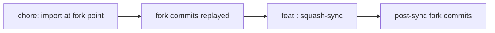

# Upstream sync

This fork tracks [gotgenes/pi-packages](https://github.com/gotgenes/pi-packages) without importing its tags.

The fork's tag namespace is only its own `pi-subagents-v*` (and later sibling package tags).
Upstream already publishes `pi-subagents-v1.0.0` through current releases; importing those tags would collide with later fork publishes and break `scripts/release/next-version.sh`.

Sync only through `scripts/upstream-sync.sh`.
Do not `git fetch --tags`, `git fetch --all --tags`, or `git fetch upstream` without `--no-tags`.
Those commands override `remote.upstream.tagOpt`.
Never run `git merge upstream/main` on `main`.
The mutating flag is `--sync` (squash-sync), which creates a single-parent commit.

## History layout

Default `git log` is a fully linear first-parent chain.



The import root is an orphan commit at the fork-point tree.
Each later squash-sync is **single-parent**.
A second parent pointing at the upstream SHA would make GitHub and flagless `git log` recurse into upstream again.

The last synced upstream SHA lives in `refs/sync/upstream-main` and in the [Sync log](#sync-log), not in `git log`'s parent walk.
That ref is local-only and is never pushed.

After reshape, `git rev-list --left-right --count HEAD...upstream/main` is unrelated-history noise.
Do not use it.
The script prints `upstream commits since last sync` (`U_old..upstream/main`) instead.
GitHub's ahead/behind against the parent repository is an accepted residual.

## When to sync

On demand.
Before a fork publish, check whether upstream `main` has new commits or a new `pi-subagents` release.

## Procedure

1. From the repo root on `main`, with a clean index and tracked worktree:

   ```bash
   ./scripts/upstream-sync.sh
   ```

   This ensures the `upstream` remote, sets `tagOpt=--no-tags` and `pushurl=DISABLE`, fetches with `--no-tags`, refuses if the local tag set changed, and prints the sync base, upstream commits since last sync, pending sync type, and the newest upstream `pi-subagents-v*` (via `git ls-remote`, which does not import tags).
   It refuses unless `refs/sync/upstream-main` exists and its 40-hex equals the last Sync log row's Upstream SHA.
   The first time that remote is added, pin the GitHub CLI default so `gh repo view` stays on this fork:

   ```bash
   gh repo set-default Jopqior/gotgenes-pi-packages
   ```

2. Review the pending count and type.
   If you want those commits on fork `main`:

   ```bash
   ./scripts/upstream-sync.sh --sync
   ```

   `--sync` refuses unless the current branch is `main`, origin is `Jopqior/gotgenes-pi-packages`, the index and tracked worktree are clean, no merge or rebase is in progress, `refs/sync/upstream-main` exists and matches the table, and that SHA is an ancestor of `upstream/main` with a non-zero commit count.
   It builds a synthetic ancestor, merges the new upstream tip onto a `sync/in-progress` branch, then transplants the result onto `main` as a **single-parent** commit whose type is derived from `old..new` (`feat!:` / `feat:` / `fix:` / `chore:`).
   It then appends a Sync log row in a follow-up `docs:` commit.
   It never pushes.
3. If the synthetic merge conflicts, recipes run on the known paths.
   Anything still unmerged leaves you on `sync/in-progress`.
   Follow [Conflict handbook](#conflict-handbook), `git add` remaining resolutions, then:

   ```bash
   ./scripts/upstream-sync.sh --continue
   ```

   `--continue` refuses unless the current branch is `sync/in-progress` and no unmerged paths remain.
   Do not `Edit`/`Write` a file that still has conflict markers.
   Do not `git checkout --ours` or `git checkout --theirs` wholesale.
4. The squash-sync commit includes a regenerated `pnpm-lock.yaml`: the script runs `pnpm install` from the repo root after materializing the tree, even if git auto-merged the lockfile with zero markers.
5. If the sync renamed files, it clears the rumdl cache:

   ```bash
   find .rumdl_cache -type f -delete
   ```

   MD057 depends on neighboring filesystem state ([gotgenes/pi-packages#879](https://github.com/gotgenes/pi-packages/issues/879)).
6. Verify:

   ```bash
   git tag | wc -l
   pnpm run check
   NODE_OPTIONS=--max-old-space-size=8192 pnpm run lint
   pnpm -r run test
   ```

7. The Sync log row is the follow-up `docs:` commit; do not write an unreleased fork version into the correspondence table.

Read-only type pin:

```bash
./scripts/upstream-sync.sh --derive-type <old> <new>
```

Prints only the type token plus a newline.

## Forbidden commands

Never run:

```bash
git fetch --tags upstream
git fetch --all --tags
git fetch upstream
git fetch --all
git push upstream
git merge upstream/main
```

`git fetch upstream` without `--no-tags` follows tags that point at downloaded objects.
`remote.upstream.tagOpt=--no-tags` is only the default when a fetch names neither `--tags` nor `--no-tags`; an explicit `--tags` still overrides it.

`pushurl=DISABLE` makes `git push upstream` fail closed.
The script never pushes.
`--merge` is gone; it exits 2 with `use --sync; squash-sync replaced merge`.

If a fetch imported tags anyway, delete them before syncing:

```bash
git tag -d <name>
```

Then re-run the script.

## Clone recovery

`refs/sync/upstream-main` is local-only.
A fresh clone will not have it.
Recreate it from the last Sync log row before any sync:

```bash
git update-ref refs/sync/upstream-main <Upstream SHA from the last Sync log row>
```

The script refuses to run `--sync` or the read-only default until the ref exists and matches the table.

## Query habits

`git log --first-parent` is redundant on this linear history; it is still safe.
`?author=Jopqior` on GitHub still filters to fork-authored commits.
To see only commits since the import:

```bash
git log --oneline $(git rev-list --max-parents=0 HEAD)..HEAD
```

Do not use `HEAD...upstream/main` as an ahead/behind metric.

## Conflict handbook

Do not take ours or theirs wholesale.
Keep fork-only spawn-selection and `fNNNN-` lookup, and keep incoming upstream behavior.

### Recurring recipes

`--sync` applies these only to unmerged paths after the synthetic merge.
Anything not in this list stays conflicted for the operator.

**`packages/pi-subagents/package.json`** — take stage 3 (theirs), restore `name` and `version` from stage 2 (ours) with `jq`.
Until [#3] those two fields still match upstream, so this is a no-op until the rename.

**`packages/pi-subagents/CHANGELOG.md`** — section splice, not ours/theirs wholesale:

1. Header = lines before the first `##` in theirs.
2. Fork-only = every `##` section in ours whose heading line is not present in theirs.
3. Result = header + fork-only (ours order) + theirs from its first `##` to EOF.

Worked example after [#3]:

```text
ours:     ## [1.0.0] + ## [21.7.0] + older
theirs:   ## [21.8.0] + ## [21.7.0] + older
result:   ## [1.0.0] + ## [21.8.0] + ## [21.7.0] + older
```

**`pnpm-lock.yaml`** — always `pnpm install` from the repo root after the sync tree is materialized, even when git reports zero markers, then `git add pnpm-lock.yaml`.

If the sync renamed files, `find .rumdl_cache -type f -delete`.

### First merge (history)

The first upstream integration was a real merge, later rewritten as the single-parent squash-sync in the [Sync log](#sync-log).
The measured content conflicts were spawn-selection versus upstream resume/compact-result, not the issue-body's predicted README / settings / issue-form / lockfile set.
Those four paths were fork-only except `pnpm-lock.yaml`, which auto-merges with zero markers and must still be regenerated.

Keep both sides.

**`subagent-manager.ts` imports** — both lines:

```typescript
import type { SelectionScopeHandle } from "#src/lifecycle/selection-scope";
import { type ResumeRefusal, Subagent, type SubagentLifecycleObserver } from "#src/lifecycle/subagent";
```

**`service.ts` imports** — union.
`SpawnSelection.model` is `Model<Api>` and `thinkingLevel` is `SubagentThinkingLevel`; the auto-merged export block already re-exports `ResumeRefusal` and `ResumeRefusalReason`:

```typescript
import type { Api, Model } from "@earendil-works/pi-ai";
import type { SubagentThinkingLevel } from "#src/config/thinking-level";
import type { ResumeRefusal, SubagentStatus } from "#src/lifecycle/subagent";
import type { ResumeRefusalReason } from "#src/lifecycle/subagent-manager";
```

**`service-adapter.ts` imports** — both type names:

```typescript
import type {
  ResumeOptions,
  ResumeResult,
  SpawnOptions,
  SpawnSelectionProvider,
  SpawnSelectionRegistration,
  SubagentRecord,
  SubagentsService,
} from "#src/service/service";
```

**`background-spawner.ts`** — concatenate.
HEAD's `isAwaitingSelection` / `launchVerb` stay; incoming annotated `details: AgentDetails` stays; the post-hunk `textResult(..., details)` already references both.

**`subagent-manager.test.ts` imports**:

```typescript
import { makeModel } from "#test/helpers/make-model";
import { makeWorkspace, makeWorkspaceProvider } from "#test/helpers/make-workspace";
```

**`.pi/skills/package-pi-subagents/SKILL.md` and `packages/pi-subagents/docs/architecture/architecture.md`** — union of unique module names and phrases, then recount files rather than adding 69+68.
HEAD has spawn-selection / selection-scope / selection-catalogue and pending-selection UI notes.
Incoming has resume choke-point wording, `bounded-lines.ts`, `get-result-renderer`, and the service resume door.
Keep every unique token.

After conflict resolution the merged `service.ts` body already lists `resume(...)` and `registerSpawnSelectionProvider(...)` on `SubagentsService`.
Do not drop either method.

### After [#3]

Upstream release commits touch `packages/pi-subagents/package.json` and `packages/pi-subagents/CHANGELOG.md`.
The recurring recipes above own those two files.
If upstream adds a new package directory, wire it per the AGENTS.md four-place list (`.pi/settings.json`, README Packages table, both issue-form Package dropdowns, `pkg:<name>` label) and do not add the npm disable entry until that package's first publish.

### Auto-merged both-sides paths

Read through after every sync even when git reports zero markers.

Restore any dropped `fNNNN-` short-circuit in `.pi/prompts/ship.md` and `.pi/prompts/plan-issue.md`.
Restore any dropped spawn-selection sentence in `AGENTS.md` or `packages/pi-subagents/**`.
`pnpm-lock.yaml` is untrusted after an auto-merge; always `pnpm install`.

Pin: `rg 'f\$\{PADDED\}' .pi/prompts/ship.md` still hits both snippets.

## Version correspondence

Each published `@jopqior/pi-subagents` version maps to the newest upstream `pi-subagents-v*` contained in that release's squash-sync.
Many-to-one is legal: several fork versions may share one upstream tag.

Do not write an unreleased fork version number here.
The first data row lands in [#3] as `1.0.0 ← 21.7.0`.

| Fork `@jopqior/pi-subagents` | Upstream `pi-subagents` tag |
| ---------------------------- | --------------------------- |

## Sync log

| Date (UTC)           | Upstream SHA                             | Upstream `pi-subagents` tag | Fork sync SHA                            |
| -------------------- | ---------------------------------------- | --------------------------- | ---------------------------------------- |
| 2026-09-12T14:16:33Z | 045213317de608c04a7b6052b2b843e3a0f2176f | pi-subagents-v21.7.0        | 01bc18fd21d58f8551931eb6d96ae76ca959c548 |

[#3]: https://github.com/Jopqior/gotgenes-pi-packages/issues/3
