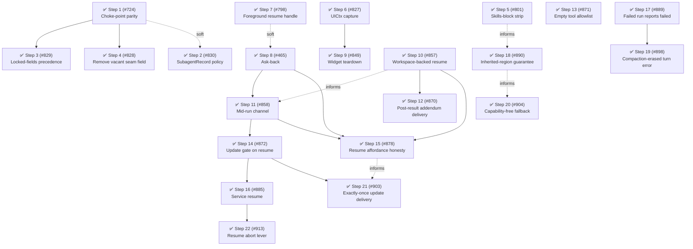

# Phase 22: Front-door contract parity and delivery fixes

## Findings (planned 2026-08-29)

Phase 22 is trigger-driven: it opens on the bug cluster surfaced by [#724]'s planning audit, not on the calendar.
The primary cause is a coupling/boundary flaw the first-principles section already names: the "Reactive versus discrete (not internal versus external)" refinement rules `SubagentsService` a first-class front door "in-package or not", but the code was never audited against that claim — the `subagent` tool door runs a config-resolution pipeline the SDK door skips entirely, and the audit found six behavioral divergences (widget invisibility, lost `parentSessionId` breaking permission forwarding, an unenforced disabled-agent block, uncanonicalized types, and more).
Four pre-filed issues express the same cause and form the spine: [#724] (parity at the manager choke point — plan already committed at `docs/plans/0724-first-class-sdk-spawns.md`), [#830] (the public snapshot's allowlist has no stated policy), [#829] (frontmatter precedence applies a guard against model guessing to deterministic callers too), and [#828] (a vacant field on the public workspace seam).
Three independent delivery-boundary defects join as side tracks ([#801], [#827], [#798]), and the operator scheduled the ask-back capability ([#465]) now that its prerequisite [#466] landed in Phase 21.

Fallow corroborates but did not source the spine: health 78/100 (B), 0 dead code, 0 duplication, 0 refactoring targets; the repeated-discriminator sweep is clean (`_status !== "stopped"` ×4 all inside the owning `subagent-state.ts`).
The craftsmanship scout found **no concentrated debt**: the fallow large-function flag on `test/settings.test.ts:312` is refuted (a healthy 17-`describe` tree of short behavior-named tests), the hot production files are well-factored linear procedures, and Phase 21's four boy-scout items persist unchanged but stay scattered — no craftsmanship step is warranted.
Phase 21 recorded no ⚠️ metric misses; its one measurement caveat carries forward — recompute the health score with the `--hotspots --targets` form (the bare `--score` form reports 88 A on this workspace and is not comparable to the 78 B baseline).

Trajectory: max step priority ran 15 (Phase 20 band) → 16 (Phase 21) → 16 (this phase), and every prior churn hotspot is cooling or stable.
The operator's cadence decision: keep the regular improvement rotation after this phase.

| Metric                                                                                           | Baseline   | Phase 22 target | Delivered     | Recompute                                                                                                                                               |
| ------------------------------------------------------------------------------------------------ | ---------- | --------------- | ------------- | ------------------------------------------------------------------------------------------------------------------------------------------------------- |
| Health score                                                                                     | 78/100 (B) | ≥ 78 (B)        | 78/100 (B) ✅ | `pnpm fallow health --score --hotspots --targets --workspace @gotgenes/pi-subagents`                                                                    |
| `invocation` storage-chain and widget-filter sites (`src/lifecycle/` + `src/ui/agent-widget.ts`) | 8          | 0 ✅            | 0 ✅          | `grep -rEn 'invocation\??:\|\.invocation\b' packages/pi-subagents/src/lifecycle packages/pi-subagents/src/ui/agent-widget.ts --include='*.ts' \| wc -l` |
| Blanket `agentConfig?.<field> ?? params` precedence merges in `invocation-config.ts`             | 5          | 0 ✅            | 0 ✅          | `grep -cE 'agentConfig\?\..*\?\?' packages/pi-subagents/src/config/invocation-config.ts`                                                                |
| Foreground result text carries the resume handle (`Agent ID` in `foreground-runner.ts`)          | 0          | ≥ 1 ✅          | 2 ✅          | `grep -c 'Agent ID' packages/pi-subagents/src/tools/foreground-runner.ts`                                                                               |
| Inherited-prompt skills-block strip present in `prompts.ts`                                      | 0          | 3 ✅            | 3 ✅          | `grep -c 'available_skills' packages/pi-subagents/src/session/prompts.ts`                                                                               |
| Dead code / production duplication                                                               | 0 / 0      | 0 / 0           | 0 / 0 ✅      | `pnpm fallow dead-code --workspace @gotgenes/pi-subagents` / `pnpm fallow dupes --workspace @gotgenes/pi-subagents`                                     |

The `Agent ID` and `available_skills` rows grep for names the fix has not created yet; Steps 5 and 7 must either use those spellings or update the row in the same commit.
The `agentConfig?.` row counts the mechanism Step 3 replaces; if the adopted locked-fields shape legitimately retains a merge of that spelling, Step 3 updates the row with its rationale.
Steps 2, 6, and 8 have design-dependent shapes and are verified by their plans' pinned regression tests rather than a grep row.

All five targeted metrics were confirmed delivered at archive time (recomputed 2026-09-19, against the `--hotspots --targets` form this baseline was computed with): every recompute command reproduces its target exactly, with no metric misses.
End-of-phase `src/` totals: 11,048 LOC across 69 files (up from the 8,836/63 baseline recorded at Phase 21's close), 1,796 tests across 79 files, maintainability 91.2 (good).
The `Total LOC`/file-count growth reflects 22 landed steps, several of them `feat:` additions (ask-back, the mid-run channel, service-exposed resume) rather than pure extraction.

### Open-issue sweep dispositions

- [#724], [#830], [#829], [#828] — adopted as Steps 1–4 (the pre-discovered front-door cluster; [#724]'s plan is already committed).
- [#801], [#827], [#798] — adopted as Steps 5–7 (independent delivery-boundary bugs).
- [#465] — scheduled as Step 8 by operator decision (2nd sweep; its prerequisite [#466] landed in Phase 21, so it is now actionable).
- [#641] — folded into Step 3 as design input: operator-configured floors versus model-passed values is the same precedence family [#829] settles.
- [#451] — relabeled `scope:repo` and the `pkg:pi-subagents` label dropped (3rd consecutive sweep; it is repo-level CI tooling, not package structure — the relabel ends the per-phase re-sweep without losing the idea).
- [#608], [#519] — deferred with rationale (2nd sweep, explicit): [#608] is an unverified third-party integration ask whose `AsyncLocalStorage` store shape the no-vacant-hooks rule declines without a concrete verified consumer; [#519] is blocked on upstream SDK clarity and is pi-permission-system-primary.
- [#779] — deferred by operator decision (offered as a phase track and declined): boundary-ADR documentation does not gate the bug-cluster spine; note PRs #613 and #740 wait on its foreground-default record.
- [#857] — filed by Step 8's planning; becomes Step 10 by operator decision.
  `completeRun()` disposes the child's workspace and `resume()` never re-prepares it, so a workspace-backed child resumes into a torn-down directory — the same delivery-boundary family as Steps 5–7, and the bound on Step 8's round trip for exactly the agents most likely to hold a worktree.
- [#858] — filed by Step 8's planning; becomes Step 11 by operator decision.
  A child-initiated mid-run channel is the half Step 8's completed-child scope leaves open; the parent-side reply channel (`steer_subagent`) already exists, so the residual is the child's ability to pause and signal.
- [#870] — filed by Step 10's planning; becomes Step 12 by operator decision.
  Step 10 holds a question-ending child's workspace open, moving its disposal to an edge with no result text to carry `resultAddendum`; the post-result delivery channel that fixes it is a peer-sized piece of the same delivery spine, not a line in Step 10's bug fix.
- [#871] — filed by Step 11's planning; becomes Step 13 by operator decision.
  A fail-open one layer below the allowlist Step 11 appends to: `tools: none` parses to an empty list and then resolves to the full built-in set, so an author who asked for no tools receives `edit`, `write`, and `bash`.
  Independent of Step 11's own work, which appends over whatever base list resolution produces.
- [#872] — filed by Step 11's pre-completion review; becomes Step 14 by operator decision.
  Step 11's own residual: the background-only gate it introduced is decided at spawn and never reconsidered at resume, so it does not hold on a path with the same blocking shape it was written to refuse.
- [#878] — filed by Step 12's planning; becomes Step 15 by operator decision.
  A carrier names a remediation the extension refuses: a released session's record keeps its `pendingQuestion`, so `get_subagent_result` and the completion nudge still advertise a resume that `AgentTool` declines.
  The same delivery-boundary family as Steps 5–7 and 12, and a peer-sized piece rather than a line in Step 12's fix, whose plan lists it as an explicit Non-Goal.
- [#885] — filed by Step 14's planning; becomes Step 16 by operator decision.
  Step 14 establishes that `record.claimed`, not spawn mode, is what marks a blocking carrier, which is the precondition for a front door that resumes without carrying the result.
  The refusal policy it must relocate from `AgentTool` into `SubagentManager` is the same front-door-parity work as Step 1, applied to the one door Step 1 did not reach.
- [#791] — deferred by operator decision (offered and declined): small self-contained warning, suitable for pickup outside a phase.
- [#733] — deferred: TUI overlay defect requiring SDK-level rendering investigation, unrelated to this phase's cause.
- [#755], [#711], [#636], [#695], [#676], [#660] — deferred: feature/UX requests that do not gate a structural phase ([#660] overlaps [#695]/[#676]).
- [#683] — deferred: glyph-audit polish at boy-scout scale.
- [#876] — filed by operator request outside any phase step; out of scope for the roadmap.
- [#896] — filed by Step 15's planning; folded into Step 16.
  Step 16 relocates `AgentTool`'s resume-refusal policy into `SubagentManager` so both front doors report the same refusals from one place, and a still-running agent is a refusal neither door makes today — it belongs in that union rather than added to `AgentTool` first and moved a step later.
- [#889] — filed by the [#884] PR review; becomes Step 17 by operator decision.
  A child whose provider errors is delivered to the parent as a successful, empty completion — the same delivery-boundary family as Steps 5–7, 10, 12, and 15, and peer-sized rather than a residual of either open step.
- [#898] — filed by Step 17's implementation (its pre-completion review); becomes Step 19 by operator decision.
  Step 17's failure read cannot see a turn error that a failed compaction attempt already stripped from session state, and the evidence is gone before the read runs — so the remedy is a different mechanism rather than a wider predicate, which makes it peer-sized rather than a residual of the shipped step.
- [#890] — filed by the [#884] PR review; becomes Step 18 by operator decision.
  `pi-permission-system` rewrites the child's prompt inside the region [ADR-0006] keeps byte-identical with the parent's, so the shared prefix [#180] and [#400] created ends at the tool list for every child with a narrowed tool set.
  Scheduled here rather than deferred because the interaction is measured now and the decision is this package's to make — it amended [ADR-0006] with [ADR-0008].
- [#912] — filed by Step 16's planning; deferred to a later phase with rationale.
  A consumer cannot ask whether an agent is resumable before calling `resume`: `SubagentRecord` carries `status` but neither `sessionReleased` nor `workspaceDisposed`, so a UI cannot grey out a Resume affordance.
  Its shape is undecided between a snapshot field (which needs an admission argument under [decision 0005](../../decisions/0005-subagent-record-admission-policy.md), whose rule 2 declines momentary state) and a service query, and it has no named consumer — an enhancement rather than a piece of this phase's front-door and delivery-boundary spine.
- [#947] — filed by a third-party reporter against the shipped package; deferred to a later phase with rationale.
  `get_subagent_result({ wait: true })` waits unbounded and its report carries no progress facts, so a child wedged inside one `bash` call for 74 minutes read as a healthy long run — `get-result-tool.ts` accepts `_onUpdate` and discards it, and the widget already renders the activity the model never sees.
  It joins [#912] and [#755] as one question: what a consumer may learn about a running child, and where [decision 0005](../../decisions/0005-subagent-record-admission-policy.md) falls between a `SubagentRecord` field (its rule 2 excludes `activeTools` and `responseText` by name) and tool-report text, which that decision does not reach.
  Deferred rather than adopted because this phase's cause is front-door parity and this has one door with no divergence; the three together are a phase's spine rather than a 23rd step.
- [#913] — filed by Step 16's planning; becomes Step 22 by operator decision.
  `Subagent.abort()` fires the record's construction-time controller, which `resumeTurnLoop` never sees, so `abort(id)` reports success on a resumed agent while its turn loop keeps running — the same shape as Steps 15 and 21, a lever set at one lifecycle edge and read at another.
  Peer-sized rather than a line in Step 16, which mitigates it for the new door with a caller `signal` and leaves the controller alone.
- [#949] — filed by Step 22's planning; deferred to a later phase with rationale.
  `RunListeners.wireSignal` and `forwardAbortSignal` both register with `addEventListener`, which never fires for a signal that is already aborted, so a run wired to a pre-cancelled signal runs to completion uncancelled.
  It is Step 22's own smell family — a lever set at one lifecycle edge and read at another — but not its residual: the fix also changes `run()`'s behavior for a pre-aborted spawn signal, which reaches a path this phase's front-door spine does not, and Step 22 is the phase's last open step.
- [#904] — filed by the [#884] PR review (second pass); becomes Step 20 by operator decision.
  Step 18's own residual, one constant below the one it fixed: [ADR-0008] removed `<sub_agent_context>` for naming `edit` and `write` to a child that holds neither, and `genericBase` asserts the same capabilities four lines down in the same file.
  It survived that sweep because it sits on the colder no-parent-prompt path rather than on append mode's every-child path, which is the same shape as [#871] — a second instance of a step's defect class inside the lines the step already touched.
- [#903] — filed by a third-party reporter against the shipped package; becomes Step 21 by operator decision.
  Step 14's own residual on the announcement side: it settled where an update is _routed_ when it is sent, and left the withheld queue flushing whatever it parked with no re-read — the same delivery-boundary family as Steps 5–7, 10, 12, 15, 17, and 19, and peer-sized rather than a line in any open step.
- [#901] — filed by Step 18's planning; deferred to a later phase with rationale.
  A child without `pi-permission-system` installed inherits the parent's `Available tools:` list, because Pi writes none under `customPrompt` and nothing in this package corrects the inherited one.
  Step 18 makes `pi-permission-system` the single writer of the relocated tool-surface block and records the order-independent contract a second writer must honor; honoring it here means this package's first per-turn `before_agent_start` handler plus a shared render function whose home is unsettled, which is new mechanism outside this phase's front-door and delivery-boundary spine.
  Transcript-pane chrome is cosmetic UI polish, unrelated to this phase's front-door contract and delivery-boundary spine, and [ADR 0007](../../decisions/0007-transcript-viewer-is-not-an-overlay.md) already settles the constraint it must respect.
- [#849] — filed by Step 6's planning; adopted as Step 9 (Track C, after Step 6).
  The widget's teardown half: `AgentWidget.dispose()` has no call site, so `session_shutdown` leaves the 80 ms interval and the widget/status registrations live.
  A different mechanism from Step 6's acquisition path, so it is a peer step rather than a fold-in.
- [#834] — filed by Step 1's implementation; folded into Step 3.
  Narrowing `SubagentManagerLike.spawn`'s `unknown` options exposed a second hole the typing had hidden — neither door validates `thinking`, and Step 3 already rewrites the precedence for that exact field family on the exact line that holds the unchecked cast.
- [#793], [#792], [#722], [#735] — pi-permission-system-primary; [#564] — pi-github-tools-primary; the `pkg:pi-subagents` labels are contextual and pull no work into this phase.
- [#942] — filed by [#937]'s planning; out of scope for the roadmap.
  It applies the one `package-pi-subagents` `offload` row from the 2026-09-17 agent-doc audit (the skill's phase list, which duplicates this roadmap) and touches no `src/`.
- Scout inventory (all scattered, persisting from Phase 21) — remains on the `tidy-first` boy-scout path: `settings.ts` `sanitize()` range-check triplication, `mock.calls[N][idx]` indexing (17 sites, 9 files), `createManager()` observer-default merge density, `(manager as any).sweep()` private reach (7 sites, one file), and the `subagent-events-observer.ts` inline `{id, type, description}` payload triad.
- [#10] — filed by operator request; out of scope for the roadmap.
  Tool-door presentation is frozen at the call's model and thinking before spawn selection overrides the pair, which is unrelated to this phase's front-door contract and delivery-boundary spine.
- [#833], [#864] — deferred by operator decision at phase-close reconciliation: [#833] is a service-door event-parity gap (`SubagentsService.steer()` doesn't emit `subagents:steered`) topically adjacent to Steps 1/16 but never adopted as a step; [#864] is a TUI blank-on-widget-render bug unrelated to this phase's front-door and delivery-boundary spine.
- [#835], [#897] — deferred by operator decision at phase-close reconciliation: feature requests (a public agent-type list API and a `claimDelivery`/`releaseDelivery` pair on `SubagentsService`) that do not gate a structural phase, joining [#755], [#711], [#636], [#695], [#676], [#660].
- [#877] — relabeled `scope:repo` and the `pkg:pi-subagents` label dropped at phase-close reconciliation, the same disposition [#451] already received: it is root-level `eslint.config.js` tooling work, not package structure.
- [#883], [#918] — follow-on work, not phase steps: [#883] landed as [ADR-0009] (portable prompt inheritance for re-homed providers, shipped in 21.5.0) and [#918] landed as [ADR-0010] (project-context directory resolution for workspace-relocated children); neither was recorded in this list when it shipped, found and backfilled at phase-close reconciliation.

## Steps

### ✅ Step 1: Land first-class SDK spawns at the manager choke point ([#724])

**Cause:** the two front doors were never held to the same contract — `SubagentManager.spawn` is the one point both doors already traverse, but it stamps no invariants, so the tool door's resolution pipeline (canonical type, disabled-agent check, background mode, parent linkage) is skipped by the SDK door.
The widget's `record.invocation?.runInBackground` read is the symptom fallow cannot see: the manager computes background-ness five times and stores it nowhere, so a consumer reconstructs it from a display snapshot one door forgets to build.

- **Smell:** Category C (coupling/boundary flaw; scattered decision).
- **Target:** `src/lifecycle/subagent-manager.ts`, `src/lifecycle/subagent.ts`, `src/service/service-adapter.ts`, `src/tools/spawn-config.ts`, `src/tools/background-spawner.ts`, `src/ui/agent-widget.ts` — per the committed plan `docs/plans/0724-first-class-sdk-spawns.md`.
- **Outcome:** `Subagent.isBackground` is first-class record state; the widget filter reads it; SDK-spawned children carry `parentSession`; the disabled-agent block holds at the choke point; the widget-filter read drops 1 of the 8 `invocation` sites.
- **Commit type:** `fix:` — the phase's first release vehicle.
- **Impact 4 / Risk 2 / Priority 16.**

Release: independent

### ✅ Step 2: Decide and document the `SubagentRecord` allowlist policy ([#830])

**Cause:** the public snapshot — the discrete-query half of the reactive/discrete split — is produced by an allowlist with no stated admission policy, so every widening (PR #748's `turnCount`/`activeTools`, [#724]'s deferred `isBackground`) re-litigates the same trade-off case by case, including the undecided question of whether third parties implement the interface at all.

- **Smell:** Category C (boundary contract left implicit).
- **Target:** `src/service/service.ts`, `src/service/service-adapter.ts` (`toSubagentRecord`), plus a policy record in this document or a new ADR; PR #748's second commit is the close target for the chosen shape.
- **Outcome:** a written admission policy (what earns a field a place; required versus optional for additions; whether the interface is a contract third parties satisfy), and the specific candidates (`turnCount`, `activeTools`, `outputFile`, `maxTurns`, `responseText`, `consumedAt`, `isBackground`) each dispositioned under it, pinned by updated service tests.
- **Commit type:** `feat:`.
- **Impact 3 / Risk 2 / Priority 12.**

Landed: `docs/decisions/0005-subagent-record-admission-policy.md` states the four admission rules, the four exclusion classes, and the produced-not-implemented contract direction.
`isBackground`, `turnCount`, `maxTurns`, and `outputFile` are admitted; `activeTools`, `responseText`, `consumedAt`, and `stoppedWhileQueued` are declined, and both halves are pinned in `test/service/service-adapter.test.ts`.
The policy's by-value definition also surfaced and fixed a snapshot aliasing the agent's live `lifetimeUsage` accumulator.
The contract direction made the widening semver-minor, so this step left the batch (see `Release batches`).

Release: independent

### ✅ Step 3: Narrow the frontmatter guard to explicitly locked fields ([#829], with [#834])

**Cause:** upstream's config-wins precedence guards against a non-deterministic _model_ guessing harness knobs, but it was applied as a blanket over every field and every caller — so a deliberate operator override (`model: "sonnet-5"` on `Explore`) is silently discarded alongside a model's guess, contradicting the tool schema and `AGENTS.md`.

- **Smell:** Category C (a decision made at the wrong boundary — per-field policy fused into a single global precedence) plus `bug`.
- **Target:** `src/config/invocation-config.ts`, `src/config/custom-agents.ts` (frontmatter `locked:` shape), `src/tools/agent-tool.ts` (schema text), `src/service/service-adapter.ts` ([#834]'s cast), `docs/configuration.md`.
- **Hard dependency:** after Step 1, whose `BackgroundRequest` two-variant mechanism this step's design builds on.
- **Design input:** [#641]'s operator-configured floors belong to the same precedence family — settle or explicitly exclude it in the step's plan.
  [#834] adds value validation to the same field family: neither door checks the level it receives, so `invocation-config.ts:26` and the mirrored cast at `service-adapter.ts` both widen an arbitrary `string` to `ThinkingLevel`.
  Trace what the SDK does with an unrecognized level before choosing between rejection, warned fallback, and narrowing the public `SpawnOptions.thinkingLevel` union.
  Builds on Step 1's `BackgroundRequest` two-variant mechanism (each door states commitment versus fallback).
- **Outcome:** blanket `agentConfig?.<field> ?? params` merges drop 5 → 0; caller-explicit wins unless the agent file locks the field; a discarded override is reported, not silent; an unsupported `thinking` value no longer reaches the child session unchecked through either door; migration note shipped.
- **Commit type:** `fix(pi-subagents)!:` — semver-major (changes effective model/thinking/turns for agent files relying on the blanket).
- **Impact 4 / Risk 3 / Priority 12.**

Landed: a caller's `subagent` parameter now wins and the agent file fills what the call leaves unset, unless the file declares `locked: true` (every field it sets — the pre-change behavior in one line) or `locked: [<fields>]` (exactly those, including fields it leaves unset).
A discarded override is reported in the tool result, on the background path as well as the foreground one — which also gave the background path the unknown-agent-type note it had never rendered.
The blanket merge row went 5 → 0.
[#834] landed with it: `src/config/thinking-level.ts` owns the level vocabulary, and both doors reject an unrecognized value rather than passing one Pi silently clamps to `off`.
The lock binds the tool door only; [#641] was excluded with rationale (a settings-layer clamp is a different mechanism at a different layer).

Release: batch "front-door-majors"

### ✅ Step 4: Remove the vacant `WorkspacePrepareContext.invocation` field and its dead storage chain ([#828])

**Cause:** a provider-seam field no consumer has ever read — the exact case the no-vacant-hooks rule names — kept alive by a storage chain (`AgentSpawnConfig.invocation` → `SubagentInit.invocation` → `Subagent.invocation` → seam) whose only other terminal reader Step 1 removes.

- **Smell:** Category A (vacant hook; a dead subsystem once Step 1 lands).
- **Target:** `src/lifecycle/workspace.ts`, `src/lifecycle/subagent-manager.ts`, `src/lifecycle/subagent.ts`, `src/tools/background-spawner.ts`, `src/tools/foreground-runner.ts`, `packages/pi-subagents-worktrees/test/workspace-provider.test.ts`; the `AgentInvocation` type survives as `spawn-config.ts`'s local display snapshot.
- **Hard dependency:** after Step 1 (otherwise the widget read keeps the chain alive and `pnpm fallow dead-code` gates the partial removal).
- **Outcome:** `invocation` storage-chain and widget-filter sites drop 8 → 0; `dist/public.d.ts` loses the field (semver-major with migration note).
- **Commit type:** `refactor(pi-subagents)!:`.
- **Impact 3 / Risk 2 / Priority 12.**

Landed: `WorkspacePrepareContext` now carries exactly the three fields a provider reads (`agentId`, `agentType`, `baseCwd`), and the storage chain behind it — `AgentSpawnConfig.invocation`, `SubagentInit.invocation`, `Subagent.invocation`, and both tool-door producers — is gone.
The storage-chain row went 8 → 0.
The step's premise about the gate was refuted by measurement: a partial removal (the seam field and its call site, chain retained) passes `tsc`, the full suite, and `pnpm fallow dead-code`, so nothing mechanical forced the one-commit shape — only the fact that a half-removed chain leaves the stored-and-unread field the step exists to delete.
The seam-context test was strengthened rather than trimmed: `toHaveBeenCalledWith` compares with `toEqual` semantics, which ignore an explicitly-`undefined` key, so it could not have seen the field return; it now asserts `toStrictEqual` on the recorded call argument.
`AgentInvocation` survives as `spawn-config.ts`'s local display snapshot for the tool result's tags.

Release: batch "front-door-majors"

### ✅ Step 5: Strip the inherited `available_skills` block from child prompts ([#801])

**Cause:** `buildAgentPrompt` embeds the parent's effective system prompt verbatim for KV-cache reuse, but Pi regenerates per-session appendages for the child — so the child gets two skills blocks, exactly the class [#640] fixed for the cwd footer, where the strip is per-appendage rather than principled.

- **Smell:** Category C (boundary flaw in prompt inheritance) plus `bug`.
- **Target:** `src/session/prompts.ts` (extend the inherited-appendage handling beside `withoutContradictoryCwdFooter`), `test/session/prompts.test.ts`.
- **Design note:** match [#640]'s discipline — strip only when the duplication is real, and preserve the shared cacheable prefix where possible; the step's plan decides whether other Pi-appended blocks belong to the same strip.
- **Outcome:** an assembled child prompt contains one `available_skills` block, pinned by a regression test; the `prompts.ts` grep row goes 0 → ≥ 1.
- **Commit type:** `fix:`.
- **Impact 3 / Risk 2 / Priority 12.**

Landed: the strip is principled rather than per-appendage — `inheritedIdentity` cuts the inherited prompt at the first layer Pi resolves per session and keeps what precedes it, so the catalogue, the cwd footer, and the blocks extensions append from `before_agent_start` all stop at the boundary.
The design note's "strip only when the duplication is real" could not be honored as written: the child's skills are resolved after `buildAgentPrompt` runs, so the two catalogues cannot be compared at assembly time, and every reachable case — identical, cwd-divergent, or a `read`-less agent that gets no catalogue of its own — wants the inherited copy gone.
The answer to "whether other Pi-appended blocks belong to the same strip" is yes, including the extension tail, which costs less shared prefix than excising around it would: nothing remaining in the child's prompt moves out of the cached region, so its prefilled token count is unchanged.
[#640]'s equal-cwd exception was withdrawn as a consequence rather than a choice — the catalogue precedes the footer, so the exception preserved no prefix once the catalogue was cut.
The `prompts.ts` grep row went 0 → 3 (measured).
Recorded as `docs/decisions/0006-inherited-prompt-is-identity-only.md`; [#846] tracks the `@gotgenes/pi-nocd` docs this invalidates.

Release: independent

### ✅ Step 6: Capture `UICtx` outside the tool-call path so the widget can render ([#827])

**Cause:** temporal coupling — the widget's ability to render is keyed to an unrelated event (`tool_execution_start` is the sole `setUICtx` site), so a session whose model never calls a tool has a permanently dark widget even for agents passing its roster filter; reachable today from any command-driven `SubagentsService.spawn`.

- **Smell:** Category C (coupling/boundary flaw) plus `bug`.
- **Target:** `src/ui/agent-widget.ts`, `src/handlers/tool-start.ts`, `src/index.ts` (composition-root wiring); PR #748's first commit carries candidate approach 1.
- **Design decision at plan time:** push at `session_start` versus a lazy `getUICtx` supplier; either way, settle the `finishedTurnAge` aging loose end (rows currently age only via `onTurnStart`).
  SDK facts pre-verified in the issue against `@earendil-works/pi-coding-agent@0.79.1` (TUI starts before extension init; `ctx.ui` is per-session stable; headless binds `noOpUIContext`) — re-verify against the pinned version at plan time.
- **Outcome:** the widget renders in a session with no model tool call, pinned by a regression test.
- **Commit type:** `fix:`.
- **Impact 3 / Risk 2 / Priority 12.**

Landed: the capture is a push at `session_start`, wired from the composition root as its own registration — Pi fans an event out to every handler an extension registers for it, so the widget's concern did not have to share a lambda with the session-lifecycle one.
The lazy-supplier alternative was refuted before the design gate rather than weighed at it: `ExtensionAPI` exposes no ambient `ui`, only the per-event `ctx.ui`, so a supplier still needs an event-driven capture and only adds an indirection.
The `finishedTurnAge` loose end was settled by retargeting the aging signal to `turn_start` rather than by a wall clock, which also corrected a miscount the move exposed: `onTurnStart` fires once per **tool call** on `tool_execution_start`, so a row seeded mid-turn could age out on the turn's second tool call.
`ToolStartHandler` became `WidgetEventsHandler` with one method per event, and the extension no longer subscribes to `tool_execution_start`.
The history file settled the step's open question: [#423]'s invariant is about inbound calls from **spawn tools**, so the tool-call gate protected nothing and `ToolStartHandler` was merely where a `ctx` was in hand.
Two gaps surfaced that the plan's file list did not name: `test/print-mode.test.ts` carries its own one-handler-per-event fixture and needed the same fan-out fix, and the widget's `turn_start` registration was unpinned — deleting it left all 1352 tests green until a fourth composition-root test was added.
Incidentally closes a timer leak: `clearWidget()` was unreachable while `uiCtx` was undefined, so a background spawn in headless mode left the 80 ms interval running until process exit.
[#849] tracks the teardown half (`AgentWidget.dispose()` has no call site) as Step 9.

Release: independent

### ✅ Step 7: Deliver the resume handle in foreground results ([#798])

**Cause:** door asymmetry in result delivery — the background path puts the agent ID in the model-visible text and the foreground path leaves it only in renderer `details`, so a foreground child that ends by asking a question cannot be answered; the resume-return edge shares the shape.

- **Smell:** Category C (asymmetric boundary) plus `bug`.
- **Target:** `src/tools/foreground-runner.ts`, `src/tools/agent-tool.ts` (resume-return edge), `src/tools/helpers.ts`.
- **Outcome:** foreground and resume result text carry the agent ID; the `foreground-runner.ts` grep row goes 0 → ≥ 1; pinned by tests.
- **Commit type:** `fix:`.
- **Impact 2 / Risk 1 / Priority 10.**

Landed: all three model-visible delivery edges — the foreground success return, the foreground error return, and the resume-return edge in `AgentTool.execute` — now carry an `Agent ID: <id>` line, spelled as `background-spawner.ts` spells it.
The `foreground-runner.ts` grep row went 0 → 2 (measured; the success and error branches each carry the literal).
The literal is written inline at each site rather than extracted into `helpers.ts`, which the step's target-file list anticipated: the metric row greps the spelling in `foreground-runner.ts` specifically, and the line renders into three different surrounding contexts.
A bare handle was chosen over a restated resume hint, for byte symmetry with the background door and because the tool's own `Guidelines:` block already binds the ID to `resume`.
The step also exposed an unpinned invariant from Step 3: the spawn-notes prefix must lead the result, but the `fellBack` test asserted only containment and was order-blind — it is now an ordering assertion, and a mutation that hoists the ID line above the notes kills it while every containment assertion stays green.

Release: independent

### ✅ Step 8: Ask-back: let a child's question reach the parent ([#465])

**Cause:** a child that ends its run by asking a question terminates into a dead end — the result channel is fire-and-forget, so the ask-back loop (child question → parent notified → parent resumes with the answer) has no supported path, even though resume itself works and Phase 21's [#466] gave resumed completions first-class events.

- **Smell:** feature with a structural seam (the delivery-domain follow-on the first-principles section anticipates).
- **Target:** to be settled by the step's plan — candidates are the notification layer (`src/observation/`), the result renderers, and the completion event payloads; scheduled by operator decision, design-first.
- **Soft dependency:** after Step 7 (the resume handle must be deliverable before an ask-back nudge is actionable in the foreground path).
- **Outcome:** a completed child whose result is a question is surfaced to the parent as answerable (mechanism per plan), pinned by an end-to-end test.
- **Commit type:** `feat:`.
- **Impact 3 / Risk 3 / Priority 9.**

Landed: the mechanism is a child-declared marker, parsed deterministically at the terminal transition and rendered by every result carrier with the exact `resume` call.
The protocol sits beside `<active_agent>` in a header both prompt modes share, because `Explore` and `Plan` are `promptMode: "replace"` and never received the `<sub_agent_context>` bridge append mode then carried (Step 18 removed that bridge) — the extraction that gave the two branches one home was the step's Tidy-First preparation, and it is why deleting the block now fails both modes' tests instead of one.
The parser ignores fenced regions and takes the last well-formed block, so a child quoting the protocol back does not trip it; the protocol's own example is fenced and its prose names the marker without angle brackets, since a bare opening tag there pairs with the fenced closing one.

Three defects surfaced under the feature and were fixed with it.
The `isBackground` guard on `onRunFinished`/`onResumeFinished` was residue from a branch it once shared with limiter accounting, so foreground children emitted no terminal event and persisted no `subagents:record`; the nudge's suppression moved to a revocable carrier claim, which is structural where the consumption re-check could lose its race on an interrupted turn.
And `get_subagent_result` and the resume return reported nothing for an `aborted`, `steered`, or `stopped` child, so one status vocabulary now backs the two presentations the carriers' differing grammar needs.

The claim is deliberately caller-scoped: `resetForResume` clears `consumedAt` but not the claim, because `runResume` calls it synchronously before `resume()` returns, so a claim cleared there would be dropped before the caller that set it could observe it.

Release: independent

### ✅ Step 9: Tear the widget down on session shutdown ([#849])

**Cause:** the widget acquires two resources — the 80 ms interval from `ensureTimer()` and the `setWidget`/`setStatus` registrations on the session's `UICtx` — and `AgentWidget.dispose()` releases both, but nothing calls it; the method carries a `fallow-ignore-next-line unused-class-member` comment so the gap stays invisible to dead-code analysis.
Step 6 is the acquisition half of the same lifecycle; this is the release half.

- **Smell:** Category A (a disposal path with no caller) plus `bug`.
- **Target:** `src/handlers/lifecycle.ts` or the widget's own event handler (per the step's plan), `src/index.ts`, `src/ui/agent-widget.ts` (drop the fallow ignore once the method has a call site).
- **Hard dependency:** after Step 6, which decides where the widget's host-event wiring lives.
- **Design decision at plan time:** whether the widget joins `SessionLifecycleHandler`'s dependency set or takes its own `session_shutdown` registration beside Step 6's wiring.
- **Outcome:** `session_shutdown` clears the interval and unregisters the widget, pinned by a composition-root test; the `fallow-ignore` comment on `dispose()` is removed.
- **Commit type:** `fix:`.
- **Impact 2 / Risk 1 / Priority 10.**

Landed: the teardown is `WidgetEventsHandler.handleSessionShutdown()` with its own `session_shutdown` registration, chosen over widening `SessionLifecycleHandler`'s dependency set — the same reasoning Step 6 recorded, and it keeps all three of the widget's host events in one module.
`AgentWidget.dispose()` now also drops its `UICtx`, so `update()` returns at its first line afterwards and disposal is final by construction rather than by call ordering.
That second decision made the first one's ordering unobservable, which the step's plan predicted and the implementation measured: swapping the two `session_shutdown` registrations leaves all 1447 tests green, because dispose-first drops the `UICtx` before the aborts can drive an `update()` and dispose-last runs after the registry is already empty.
The planned ordering test was dropped rather than committed — it survived its own mutation, and `composition-root.test.ts` claims that only it fails when wiring is removed.
The order is kept as defensive intent in an `index.ts` comment.

Two of the step's plan-time claims were wrong in the same direction, both about `fallow dead-code` pinning the wiring.
Fallow counts test call sites, so the `fallow-ignore` comment went stale as soon as the widget's own `dispose()` tests existed — one step earlier than the plan scheduled its removal, and failing in the opposite direction.
For the same reason the gate can never pin production wiring: with the registration deleted and no suppression, fallow reports nothing.
The composition-root tests are the only pin, and they had to be rewritten to become one — a first draft that left the agent running at shutdown passed without the fix, because the abort's notification settles after `manager.dispose()` empties the registry and `update()` then takes its idle path into `clearWidget()`.
Driving the agent to completion first removes that incidental teardown.
The diagnosis and the widget-level assertion set are credited to PR #850.

The plan's own baseline row is wrong and is left as written: it records 1438 tests as 1440 across 75 files rather than 74, having been measured while a disposable spike file was still on disk.
The true baseline was 1438 / 74, and this step ends at 1447 / 74.

Release: independent

### ✅ Step 10: Re-prepare or refuse a workspace-backed resume ([#857])

**Cause:** `Subagent.completeRun()` disposes the child's workspace on every terminal transition (`workspaceBracket.dispose(...)`, whose addendum it folds into the result), while `resume()` reuses the existing session and never re-prepares one — a boundary plan `0466` drew deliberately for its own scope and never revisited.
A child spawned under a registered `WorkspaceProvider` therefore resumes into a directory the provider has torn down, with no signal.

- **Smell:** Category C (asymmetric lifecycle bracket) plus `bug`.
- **Target:** `src/lifecycle/subagent.ts`, `src/lifecycle/workspace-bracket.ts`, `src/tools/agent-tool.ts` (the resume-refusal message, which already has a released-session precedent).
- **Design decision at plan time:** re-prepare on resume versus refuse with a message, per the `sessionReleased` precedent.
- **Outcome:** a workspace-backed resume either re-prepares its workspace or is refused with a message naming why; pinned by a test with a stub provider.
- **Commit type:** `fix:`.
- **Impact 2 / Risk 2 / Priority 8.**

Landed: both halves, because re-prepare turned out not to be available and refusal alone would have left the ask-back loop closed to exactly the agents the step was filed for.
A completed run that declared a question holds its workspace for the resume that question invites; every other outcome disposes at run end as before, so a stopped child still gets its rescue branch immediately.
The refusal covers the rest, keyed on a workspace actually prepared and disposed rather than on `hasProvider()` — the git-worktree provider declines every agent type outside `worktreeAgents`, so provider-registered is true for nearly every child.

Re-prepare was ruled out on three independent facts, all in the provider rather than the core: the session's cwd is a value frozen at `createSubagentSession` time with no setter, `createWorktree` randomizes the path with a UUID suffix, and a re-prepared worktree checks out the parent's HEAD without the work the first cleanup committed to `pi-agent-<id>` — whose branch name the second cleanup would then collide with.

Disposal is now reachable from four edges, so `WorkspaceBracket.dispose()` releases the workspace before delegating and became idempotent; the flag is raised before the delegate call, because a provider whose teardown throws leaves a workspace no safer to reuse than a clean one.
The deferred edge has no result text to fold `resultAddendum` into, which is the residual [#870] (Step 12) records.

Release: independent

### ✅ Step 11: Child-initiated mid-run channel ([#858])

**Cause:** the parent can reach a running child (`steer_subagent`), but a child that needs information mid-run has no way back — it can only terminate and rely on Step 8's end-and-resume loop, which loses a workspace (Step 10) and expires with the retention window.
A non-terminal one-way message (a material finding mid-run) has no expression at all.

- **Smell:** feature completing Step 8's capability at the half its scope excludes.
- **Target:** to be settled by the step's plan; design-first.
- **Hard dependency:** after Step 8 (the completed-child loop must exist and be exercised before its blocking counterpart is designed) and informed by Step 10.
- **Design decision at plan time:** the child tool allowlist ([#725]) filters any new child-facing tool out of every agent declaring `tools:`, including built-in `Explore` and `Plan` — force-inclusion breaks the documented contract, and per-agent edits do not scale.
  A blocked child also holds its concurrency slot.
- **Outcome:** a running child can signal its parent and receive a reply without terminating (mechanism per plan), pinned by an end-to-end test.
- **Commit type:** `feat:`.
- **Impact 3 / Risk 4 / Priority 6.**

Landed as two tools rather than one blocking channel, because the blocking half turned out to duplicate Step 8.
A blocking `ask` delivers the same outcome as the end-and-resume loop — child needs an answer, parent supplies it, child continues with full context — differing only in which status the child sits in, which parent tool answers, and which clock bounds the wait; shipping both would have made the child choose between two protocols taught by two prompt blocks.
The step's `Outcome:` is met asynchronously instead: the child sends a one-way update, the parent replies with the `steer_subagent` that already exists, and the child picks the reply up at its next turn boundary having never terminated.

The design decision the step names was answered by dissolving it.
The marker Step 8 shipped was itself a tool wearing a protocol's clothes: `ask-back.ts` was 222 lines, of which roughly 120 were quote-detection that exists only because a marker embedded in free text can be quoted by the child that must not trip it.
So `ask_parent` replaces the marker rather than joining it, and the change is a carrier swap rather than an allowlist widening — the core already installed that protocol in every child through the prompt. § "Child tool selection" and the scope table now draw the boundary at capability rather than provenance, which answers the additive-key gap [#775] recorded.
The concurrency-slot concern in the step's design note lapsed with the blocking half: nothing waits, so no slot is held.
`notify_parent` shipped background-only — a foreground parent is blocked inside its own `subagent` call, and the nudge is withheld until that run settles, so the update could only ever arrive after the result did.
Step 14 replaced that gate with the carrier claim, which describes the same blockage on the two paths spawn mode misses.

The retention half of [#858]'s motivation was a sweep bug rather than a missing channel, and landed as its own `fix:`: reading a child's question counted as collecting its outcome, dropping the session to the 10-minute consumed window when the answer is delivered by resuming that very session.

Release: independent

### ✅ Step 12: Deliver a workspace addendum produced after the result edge ([#870])

**Cause:** `Workspace.dispose()` returns a `resultAddendum` the core folds into the child's result text, so the string only has a reader while a result is still being built.
Step 10 holds a question-ending child's workspace open and moves its disposal to `releaseSession()`/`disposeSession()`, where the child's result was delivered long ago — the addendum is produced and dropped.
For `@gotgenes/pi-subagents-worktrees` that string is the only thing naming the rescue branch, and the preserved-worktree scan does not cover a cleanup that succeeded.

- **Smell:** Category C (a value produced at an edge with no channel) plus `bug`.
- **Target:** to be settled by the step's plan — candidates are a completion nudge (`src/observation/notification.ts`), a `child-lifecycle.ts` event, and a record field `get_subagent_result` surfaces.
- **Hard dependency:** after Step 10, which creates the condition.
- **Design decision at plan time:** which channel carries a string produced after the result edge, given that [decision 0005](../../decisions/0005-subagent-record-admission-policy.md) withholds momentary activity from `SubagentRecord` but admits durable-artifact pointers.
- **Outcome:** a workspace disposed after its child's result was delivered still reaches the parent or the user, pinned by a test that drives disposal through the retention path.
- **Commit type:** `fix:`.
- **Impact 3 / Risk 3 / Priority 9.**

Landed as all three candidate channels rather than a choice between them, because each covers a different subset of the five disposal edges and none covers them all.
The record carries the notice and the four existing outcome carriers report it, which fixes `failRun` and `failResume` — a drop that predates Step 10, since `cleanupWorktree` commits a dirty tree whatever the status.
A standalone `<workspace-notice>` announcement covers the retention sweep and the session switch.
Neither reaches shutdown: `handleSessionShutdown` disposes notifications before the manager, deliberately, so no in-band channel exists there at all.

The shutdown edge is covered outside the core instead, by a stateless scan in `@gotgenes/pi-subagents-worktrees` for `pi-agent-*` branches unmerged into `HEAD`, reported at the next session start beside the preserved-worktree warning.
A scan of durable state rather than a record of what was dropped, so it covers a crash too, and `--no-merged` makes it self-validating — a branch leaves the report when its work is merged, with no clearing rule to get wrong.
The cost, accepted at plan time, is that it also names a branch the parent was told about and never merged.
An earlier candidate that would have told the provider its addendum has no reader was dropped: the scan needs no per-disposal signal, so `WorkspaceDisposeOutcome` is unchanged.

The announcement uses `triggerTurn: false` with no `deliverAs`, read from the pinned SDK's `sendCustomMessage` rather than inferred: `nextTurn` only buffers, rendering nothing and discarding on quit, while the chosen path appends immediately when the parent is idle and at `turn_end` when it is streaming.
That also removed the need for a parent-run withhold, a third `PendingAnnouncement` variant, and the exhaustive-switch refactor the Tidy-First assessment had recommended for it.

`CompositeSubagentObserver` declares the new member **required** though `SubagentManagerObserver` has it optional.
The manager's observer is always the composite, which implements the interface by enumerating every method, so an optional member it omits is dropped with no compiler error and no runtime error — the assessment caught this in the design, and a test is the only pin for it.

Release: independent

### ✅ Step 13: Resolve `tools: none` to no tools ([#871])

**Cause:** `AgentTypeRegistry.getToolNamesForType` picks with `config?.toolNames?.length ? config.toolNames : [...BUILTIN_TOOL_NAMES]`, so a deliberate empty list takes the same branch as an omitted key.
The frontmatter parser is correct and `test/config/custom-agents.test.ts` pins `tools: none` to `[]`; the distinction is lost one layer down, and the child session's SDK allowlist becomes the full built-in set.
It fails open — the tools silently granted include `edit`, `write`, and `bash`.

- **Smell:** Category C (a truthiness check standing in for a three-valued distinction) plus `bug`.
- **Target:** `src/config/agent-types.ts` (`getToolNamesForType`), `test/config/agent-types.test.ts`, which covers the omitted-key fallback, an explicit list, and an unknown type but has no empty-list case.
- **Outcome:** an agent declaring `tools: none` runs with no tools and the omitted-key fallback is unchanged, pinned by a test for each of the three inputs (absent, empty, listed).
- **Commit type:** `fix:`.
- **Impact 3 / Risk 1 / Priority 15.**

Landed by removing two coalescing points rather than one.
`getToolNamesForType` now delegates to `resolveAgentConfig` and reads `?? [...BUILTIN_TOOL_NAMES]`, which drops the truthiness check **and** the `enabled !== false` guard that turned a disabled agent into a request for all seven built-ins — a second fail-open of the same shape, unreachable because `SubagentManager.resolveSpawn` rejects a disabled type at every front door, and now failing closed if a future door ever bypassed it.
The registry resolves a type through one lookup, so the two methods can no longer disagree about which config a type names.

Release: independent

### ✅ Step 14: Hold the mid-run update gate on the resume path ([#872])

**Cause:** `Subagent.canSendUpdates()` reads `isBackground`, fixed at construction, and is consulted only inside `run()`.
A resume reuses the session and the tools installed with it, so nothing recomputes the gate — while `AgentTool` awaits `manager.resume(...)` inside the parent's own tool call, which is the same blockage the gate refuses for a foreground child.
A background child's update during a resumed run therefore lands after that resume's own result, the outcome Step 11's design calls "a tool whose every call is late."

- **Smell:** Category C (a decision cached at one lifecycle edge and read at another) plus `bug`.
- **Target:** `src/lifecycle/subagent.ts` (`canSendUpdates` and its call site), `src/session/notify-parent-tool.ts` (the rationale in its module comment), and whichever of `docs/configuration.md` / the plan's "Who gets which tool" table the settled answer contradicts.
- **Hard dependency:** after Step 11, which introduced the gate.
- **Design decision at plan time:** whether to hold the gate per run, accept the lateness and narrow the stated rationale, or revisit the foreground exclusion itself.
  The third is the one to weigh first: if late-but-delivered is acceptable on the resume path it is worth asking what the foreground exclusion buys, since it is what makes the child's tool set vary by spawn mode against Step 1's parity direction.
- **Outcome:** the gate and its stated rationale agree on every path a child can run, pinned by a test that drives `notify_parent` through a resumed run — the path `subagent.test.ts` does not currently reach.
- **Commit type:** `fix:`.
- **Impact 2 / Risk 2 / Priority 8.**

Landed by replacing the predicate rather than recomputing it.
Planning found a third window the step's cause does not name: `get_subagent_result` with `wait: true` claims the outcome and blocks the parent on a **background** child's initial run, with no resume involved — so neither spawn mode nor "is this a resume" describes the condition.
`record.claimed` does, it was already set at all three blocking front doors, and `sendCompletion` already consulted it; the substitution subsumes the old gate rather than replacing it, since a foreground run is claimed for its whole duration.

The tool now reaches every child, and each message is routed per call: a claimed run's update is rendered by the carrier holding that outcome, an unclaimed run's is announced as it happens, and the lifecycle event fires either way.
The three carriers' duplicated `renderWorkspaceNotice + renderQuestionAffordance` tail became `renderOutcomeAddenda` first, so the new element was inserted once rather than three times.
The foreground error branch composes it directly — that return never reaches the tail, and a failed run is where mid-run findings are the only thing that survives.

Release: independent

### ✅ Step 15: Stop advertising a resume that will be refused ([#878])

**Cause:** `renderQuestionAffordance` renders "Answer by calling subagent with resume" from `pendingQuestion` alone, and nothing clears that field when a resume stops being possible.
`releaseSession()` leaves it set, so a swept record still advertises the call `AgentTool` refuses as a released session; Step 10's `workspaceDisposed` refusal is a second such path.

- **Smell:** Category C (an affordance derived from one fact when its precondition rests on several) plus `bug`.
- **Target:** `src/observation/outcome-delivery.ts` (`renderQuestionAffordance`, which today takes only an id and a question), `src/tools/get-result-report.ts` and `src/observation/notification.ts` (its two carriers), and `src/lifecycle/subagent.ts` (whichever record fact the affordance comes to read).
- **Hard dependency:** after Steps 8, 10, and 11, which together create both refusal paths.
- **Design decision at plan time:** whether the affordance is suppressed when a resume would be refused, or names what is still possible instead; and whether resumability becomes one record predicate the tool and the carriers share, rather than each re-deriving it.
- **Outcome:** no carrier names a resume the extension would refuse, pinned by a test for each refusal path (released session and disposed workspace).
- **Commit type:** `fix:`.
- **Impact 2 / Risk 2 / Priority 8.**

Landed as one record predicate both sides read: `Subagent.resumeRefusal` returns `"no-session" | "session-released" | "workspace-disposed" | undefined`, composing the three facts in the order the resume door checked them, and `AgentTool`'s three inline guards became an exhaustive switch over it.
The carriers read the same value, so a fourth refusal cannot reopen the gap: the union is what the switch is exhaustive over, and the field is **required** on `OutcomeAddenda` and `AgentReport`, which is what makes an omission a compile error rather than a silent re-advertisement.
It is a getter rather than a predicate method for that requirement — a live record satisfies a field structurally only as a property, and two of the four carriers pass the record straight into `renderOutcomeAddenda`.

The affordance names what is still possible rather than falling silent: an unanswerable child still reports its question, with a subordinate clause naming why and a pointer at spawning a new agent.
The clauses are a `Record<ResumeRefusal, string>` beside `STATUS_MEANINGS`, echoing the door's own sentences without sharing a string with them — the same `label`/`detail` split, for the same reason.

Planning found the faster of the two paths, which the issue does not name: `completeRun()` holds the workspace only for a `completed` child, while an aborted or steered one keeps its question, so that child advertised a refused resume at run end with no sweep involved.
It is the path the nudge's test drives.
The `no-session` clause was reworded from "it has no session to resume" to "it has no active session" because the template appends a colon to it, producing the literal `resume:` — caught by a test asserting the token's absence across all three reasons rather than by reading the string.

Release: independent

### ✅ Step 16: Expose resume on `SubagentsService` ([#885], with [#896])

**Cause:** `SubagentManager.resume` has exactly one caller — `AgentTool`'s resume branch — so a resume can originate only from a parent model's tool call, and no extension can continue a child.
The front door is also unequal to its siblings: `AgentTool` owns four distinct refusals (unknown id, no active session, released session, disposed workspace), each with its own operator-facing sentence, while `SubagentManager.resume` checks `isSessionReady()` alone and collapses all four into `undefined`.
That is the same policy-above-the-choke-point shape Step 1 corrected for spawn.
Neither door refuses a resume of a **running** agent at all ([#896]): `resetForResume()` rewinds the record and `resumeTurnLoop` starts while the original `runTurnLoop` is still awaiting the same session, and the ask-back affordance names that call during the window between `ask_parent` and the child's turn ending.

- **Smell:** Category A (a front door whose policy lives in one caller rather than at the choke point) plus `enhancement`.
- **Target:** `src/lifecycle/subagent-manager.ts` (`resume`, which gains the refusal policy), `src/tools/agent-tool.ts` (its resume branch, which comes to read that policy rather than own it), `src/service/service-adapter.ts` and `src/service/service.ts` (the new method and its contract), and `src/lifecycle/subagent.ts`'s `resumeRefusal` (Step 15's predicate, which gains the still-running arm).
- **Hard dependency:** after Step 14, whose claim-based routing is what lets a non-blocking front door exist at all — a service resume that carries no result must not be treated as a blocking carrier.
- **Design decision at plan time:** what a refusal looks like across the service boundary (thrown error, discriminated result, or `undefined` plus a reason); whether the caller declares that it will carry the outcome (`record.claim()`) rather than the door deciding; and whether [#832]'s `subagents:resumed` emission is folded in, since a service resume has no tool result to observe.
- **Outcome:** an extension can resume a child through `SubagentsService`, and both front doors report the same refusals — the four `AgentTool` owns today plus the still-running one from [#896] — from one place, pinned by a test per refusal at each door.
- **Commit type:** `feat:` (semver-minor on the service contract).
- **Impact 3 / Risk 2 / Priority 12.**

Landed: the policy relocation found less to move than the step's cause describes, because Step 15 had already put the _policy_ on the record — what stayed above the choke point was the **check**.
`SubagentManager.resume` now reads `resumeRefusal` and returns `{ kind: "resumed"; record } | { kind: "refused"; reason }` over the record's four reasons plus `unknown-agent`, the one refusal that is not a fact about a record; `AgentTool` keeps only a sentence per reason.
Two things went with it: the door's `getRecord` pre-read, and its "Failed to resume" branch, which nothing could reach once the refusal check and `Subagent.resume` had no await between them.

[#896]'s arm is checked first and reads `isRunning()`, so a run that has not created its session yet reports the live run rather than the missing session; a queued agent keeps `no-session`, which is the truth about it.
The affordance needed a second template rather than a fourth clause: the three existing reasons ask the parent to give up, where this one asks it to wait, so the clause table narrowed by type (`Exclude<ResumeRefusal, "still-running">`) and the renderer branches.
The transient wording names no `resume:` call at all, which widened Step 15's token-absence assertion from three reasons to four.

[#832] was folded in on a new `subagents:resuming` channel, fired from `Subagent.runResume` after the rewind — so it covers the tool door too, and a subscriber reading the record sees the run that just started.
The widget takes it as `startLoop` rather than `update`, a defect planning did not anticipate: its timer stops once nothing is running, and a resumed agent is running again.
Two residuals were filed rather than absorbed: [#912] (no pre-call resumability query) and [#913] (`abort(id)` does not reach a resumed turn loop, which `ResumeOptions.signal` mitigates for the new door only).

Release: independent

### ✅ Step 17: Report a failed child run as failed ([#889])

**Cause:** `runTurnLoop` calls `lifecycle.completed(...)` unconditionally once `session.prompt()` resolves, and Pi does not throw on a provider failure — `_handlePostAgentRun` records an assistant message with `stopReason: "error"` and an `errorMessage`, then ends the turn normally.
Neither field is read anywhere in `src/`, so `record.status` never becomes `error` and the `Agent failed:` branch is unreachable for this class of failure.
A second fail-open of the same shape masks it: `renderOutcomeBody` guards with `??`, which passes an empty string through, so the parent receives a completion header followed by nothing and confabulates the child's work.

- **Smell:** Category C (a run outcome derived from whether a call returned, when the fact it reports rests on the turn's own stop reason) plus `bug`.
- **Target:** `src/lifecycle/subagent-session.ts` (`runTurnLoop`, `resumeTurnLoop`, and `getLastAssistantText`, which reads message text and ignores the stop reason), `src/lifecycle/child-lifecycle.ts` (whichever outcome the failed edge comes to publish), and `src/observation/outcome-delivery.ts` (`renderOutcomeBody`'s empty-string guard).
- **Hard dependency:** none — independent of Steps 15 and 16.
- **Design decision at plan time:** whether an errored turn maps onto the existing `error` status or a distinct one, since the child may have done real work over several turns before failing on a later one; and whether `errorMessage` reaches the parent verbatim or is summarized.
- **Outcome:** a child turn ending in `stopReason: "error"` is reported as a failed run carrying its error text, and an empty result renders `No output.` in every carrier — pinned by a test for the errored turn and one for the empty-string render, which today's `undefined`-only test does not cover.
- **Commit type:** `fix:`.
- **Impact 4 / Risk 2 / Priority 16.**

Landed: the failed edge **throws** rather than reporting a distinct outcome, joining the path workspace-prepare and session-factory failures already take into `failRun`/`failResume`.
`readTurnFailure` reads the last assistant message's stop reason and `failIfProviderErrored` throws on `"error"`, called from both `runTurnLoop` (before the `completed` emit) and `resumeTurnLoop`.
Step 19 later replaced that backward scan over `session.messages` with a live `message_end` recorder; the throw, both call sites, and the `"error"` predicate are unchanged.
So `src/lifecycle/subagent.ts` needed no change, `resumeTurnLoop` kept its `Promise<string>` signature, and `src/lifecycle/child-lifecycle.ts` was left untouched: a failed run publishes no `completed` event, which is what a session-factory failure already did.
`getLastAssistantText` was examined and deliberately left alone — it skips empty-text messages to find the child's last words, and the provider's failure message is exactly a message with no text, so reusing its predicate would walk past the erroring message to an unrelated earlier one.
The errored turn maps onto the existing `error` status with `errorMessage` verbatim and uncapped; the failed foreground return additionally names the transcript, which is the parent's only route to the child's partial work.

Release: independent

### ✅ Step 18: Decide what the inherited prompt region guarantees ([#890])

**Cause:** `AgentPrepHandler` in `@gotgenes/pi-permission-system` narrows the child's `Available tools:` list by rewriting the assembled prompt in place and returning it from `before_agent_start`.
That block sits inside the identity region [ADR-0006] keeps, and `buildAgentPrompt` places that region first precisely so the child's leading bytes match the parent's, so for any child with a narrowed tool set the shared prefix ends at the tool list — measured at offset 412 of a 22,157-character prompt.
The conflict is arithmetic rather than a defect in either package: a byte-identical prefix and an honest child tool list cannot coexist while the list lives inside the prefix.

- **Smell:** Category A (two packages asserting different invariants over the same bytes, with load order deciding which wins) plus `bug`.
- **Target:** `src/session/prompts.ts` (`inheritedIdentity` and what it guarantees), `docs/decisions/0006-inherited-prompt-is-identity-only.md` (amended or superseded), and the contract `@gotgenes/pi-permission-system`'s tool-surface pass writes against.
- **Hard dependency:** none, but it is the one step here whose resolution binds another package; [#890] records the four candidate resolutions.
- **Design decision at plan time:** which invariant wins, and whether the child's tool section is cut from the inherited identity like the catalogue and footer before it, appended after it, or built at assembly time from the `toolSnippets` `before_agent_start` already carries — the last composes with the other two rather than replacing them.
- **Outcome:** one recorded decision about what the inherited region guarantees, and the two packages stop using "byte-stable" for two different invariants.
- **Commit type:** `fix:` if the prefix is restored, `docs:` if the loss is accepted and recorded.
- **Impact 4 / Risk 3 / Priority 12.**

Landed: the prefix is restored, by a fifth resolution none of the four candidates named — the tool surface is **relocated** out of the identity rather than the two invariants being traded off.
`pi-permission-system` now removes the `Available tools:` and `Guidelines:` sections pi wrote and renders its own after the cwd footer, in every node, from `systemPromptOptions.toolSnippets` and each allowed tool's `promptGuidelines` ([its ADR 0014]).
Rendering from parts rather than narrowing text is what makes the child case work: a child's inherited identity carries no tool section to narrow, because its parent's node already relocated it — and it retires a hard-coded table of eight literal pi sentences that attributed no third-party tool's guidelines.
The relocation had to run in every node: doing it in children alone would leave the parent's list at offset 171 and collapse the identity to 171 shared characters, worse than the 365 measured before the change.

[ADR 0006] is amended rather than superseded by [ADR 0008]: the cut is unchanged, but the byte-identical goal is retired for "shared parts", scoped to hosts that reuse a prefix over the system text independently of the tool definitions — Anthropic's cache prefix covers `tools` first, so a child never had a hit to lose there.
This package's half is the `<sub_agent_context>` removal (its tool bullets duplicated pi's own `promptGuidelines` and named `edit`/`write` to children that have neither) plus the first test to pin the shared prefix at all, which the property had never had.
The no-`pi-permission-system` case is left to [#901] with its order-independence contract recorded.

Release: independent

### ✅ Step 19: Report a run whose failed compaction erased the turn error ([#898])

**Cause:** Step 17 decides a run failed by reading the last assistant message's stop reason, but `_checkCompaction`'s first-overflow branch strips that message from `agent.state.messages` before attempting compaction, and restores nothing when the compaction attempt itself fails.
`AgentSession.messages` is that array by reference, so the failure read scans past the erased turn to an earlier assistant message and reports success — stale text from a prior turn, or `""` on the first.
The second overflow attempt does not strip, so it is the first attempt's own failure that is invisible.

- **Smell:** Category C (an outcome reconstructed after the fact from state a collaborator is free to rewrite) plus `bug`.
- **Target:** `src/lifecycle/subagent-session.ts` (the failure read, which cannot see this) and `src/observation/record-observer.ts` (which already subscribes to `compaction_end`).
- **Hard dependency:** after Step 17, whose failure read this extends to the one door it cannot reach.
- **Design decision at plan time:** which event carries enough to distinguish "compaction failed and took the turn's error with it" from "compaction failed but the turn was fine" — establish this against the pinned SDK before designing, since the fix is a mechanism change rather than a wider predicate.
- **Outcome:** a run whose compaction attempt failed reports `error` rather than a stale-text success, pinned by a test driving the strip-then-fail sequence.
- **Commit type:** `fix:`.
- **Impact 3 / Risk 3 / Priority 9.**

Landed: neither candidate event carries enough, which is what displaced the event-driven design the `Target:` anticipated.
`_runAutoCompaction` has six exits after the strip: three emit nothing at all (`!this.model`, an auth throw before `started`, and a falsy `preparation`), two emit only `aborted: true`, and only the summarization throw carries an `errorMessage`.
The silent `preparation` exit is the one a child most plausibly takes — `prepareCompaction` returns `undefined` when nothing is left to summarize, which is exactly a child whose spawn prompt alone overflows on its first LLM call.
`compaction_end` also cannot separate the stripping Case 1 from the non-stripping Case 2, since both carry `reason: "overflow"`.

So the outcome is recorded from the session's own `message_end` events as they arrive — `collectTurnFailure`, a sibling of the `collectResponseText` collector already in the file — rather than reconstructed from `session.messages` afterwards.
That covers every exit and stops the read depending on who owns `agent.state.messages`; `src/observation/record-observer.ts` was left untouched, and its `compaction_end` gate still ignores failures because a compaction that failed did not happen.
Last-one-wins rather than latched, so a recovered auto-retry still reports success.
The collector is owned by the `SubagentSession` and subscribed for the session's whole life rather than per turn loop, which the pre-completion review established over two rounds is load-bearing.
`prompt()` resolves without running a turn when an extension command matches, when an `input` handler reports the prompt handled, or when the message is queued while streaming, and a resume is not refused for an agent whose earlier run failed — so such a call observes no event of its own and must read what the collector was already holding.
A per-call collector cannot supply that, and neither can a per-call history read: the failure an earlier call observed may be exactly the one Pi's overflow recovery stripped.
The collector is still seeded from history at construction, for turns that predate its subscription.
The predicate is unchanged from Step 17: an unrescued truncation (`stopReason: "length"`), which Case 1 also strips, deliberately still reports as a completion, because it carries the child's real text.

Release: independent

### ✅ Step 20: Stop the fallback base claiming tools the child does not hold ([#904])

**Cause:** `genericBase` in `src/session/prompts.ts` asserts "You have full access to read, write, edit files, and execute commands" to every agent type, including `Explore` and `Plan`, whose `tools:` lists in `src/config/default-agents.ts` carry neither `edit` nor `write`.
[ADR-0008] removed the `<sub_agent_context>` block for making that exact claim, and did not reach the constant four lines below it in the same file.

- **Smell:** Category C (prose asserting a capability set the session does not own) plus `bug`.
- **Target:** `src/session/prompts.ts` (`genericBase` and the `buildAgentPrompt` fallback that reaches it).
- **Hard dependency:** none; Step 18 shipped the reasoning this applies.
- **Design decision at plan time:** whether the sentence is deleted outright or the base is rendered from parts.
  Establish how reachable the no-parent-prompt path actually is first — if it is genuinely cold, the deletion is the whole fix, and rendering from parts is scope [ADR-0014] already covers per session.
- **Outcome:** no child prompt asserts a capability its tool set does not include, pinned by a test asserting a read-only agent's fallback prompt names neither `edit` nor `write`.
- **Commit type:** `fix:`.
- **Impact 2 / Risk 1 / Priority 10.**

Landed: the reachability question the `Design decision` asks came out the other way round.
The no-parent-prompt path is not cold but **dead** — `assembleSessionConfig` always passes an `InheritedPrompt`, so `buildAgentPrompt`'s `inherited === undefined` arm is reached only from tests.
The live arm is `adoptedIdentity`'s portable fallback, and for the `portable` population it is the _default_ identity, since it fires for any parent running without `--system-prompt` and `--append-system-prompt`.

The fix went past the capability sentence the `Cause:` names.
The constant is the identity of **every** agent type, including a user's custom one, so its role sentence was three further unverified claims: "coding" (the domain), "general-purpose" (a built-in agent type's name), and "for complex, multi-step tasks" (that type's `description`, verbatim).
What remains is the one sentence that was never a claim — `# Instructions` / "Do what has been asked; nothing more, nothing less." — measured at 66 characters against 199.
Rendering the tool surface here was declined as [ADR-0014]'s scope, and making the base agent-aware was declined for requiring `AgentPromptConfig` to carry `description`.

The pin is region-scoped rather than prompt-scoped: `Explore`'s own prompt names writing legitimately, to prohibit it, so the assertion reads the identity ahead of the `<active_agent>` tag.
A preparatory `test:` commit first named the fallback text in one constant, collapsing seven assertions that each spelled a different fragment of it.

Release: independent

### ✅ Step 21: Deliver each mid-run update once, on the channel that can reach the parent ([#903])

**Cause:** `NotificationManager` withholds an announcement for the parent's agent run and flushes it at `agent_settled`, but the flush re-reads nothing for an update — `emitIndividualNudge` re-checks the claim and consumption, `emitUpdate` re-checks neither.
A message parked before the parent collected that child's outcome therefore arrives after it, still carrying the unconditional "The agent is still running.
Steer it with `steer_subagent(…)`" affordance that `SteerTool` refuses for a completed child.
The content had nowhere else to go: Step 14 records an update on the run only when a carrier had _already_ claimed it, so an update-then-claim ordering leaves the announcement path its sole carrier.

- **Smell:** Category C (a decision taken at one lifecycle edge and acted on at another) plus `bug`.
- **Target:** `src/observation/notification.ts` (`sendUpdate`, the flush, `emitUpdate`, `buildPointerLines`), `src/lifecycle/subagent.ts` (`announceUpdate`), and `src/lifecycle/subagent-state.ts` (the run-update buffer).
- **Hard dependency:** after Step 14, which introduced the routing this corrects; Step 15 informs it — both hold a carrier to naming only what the extension would accept.
- **Design decision at plan time:** whether a stale update is reworded, dropped, or re-routed, and whether the completion nudge becomes a carrier of the run's updates.
- **Outcome:** every update reaches the parent exactly once, on a channel that can act on it, pinned by a test per delivery path — including the two orderings the report names.
- **Commit type:** `fix:`.
- **Impact 3 / Risk 2 / Priority 12.**

Landed as one ledger and one predicate.
Every update now joins the run's buffer whoever delivers it, each entry remembering whether the announcement channel took it, so `runUpdates` renders what the run still _owes_ rather than what a claim happened to capture.
`canAnnounceUpdate` (`!claimed && isActive()`) is read at enqueue and again at emit, which is the re-check the flush lacked; a terminated run's updates ride its outcome instead, and the completion nudge — until now the one carrier rendering none — renders them.
The "still running" affordance is left worded as it was: the guard immediately above it is what makes the sentence true, and a second home for that invariant would only let the two disagree.

Planning measured Pi's own loop in the pinned `@earendil-works/pi-coding-agent@0.84.4` bundle rather than reasoning from the extension's queue: steering is polled every turn, follow-ups only where the run would otherwise end.
The withhold is therefore not what makes an update late — deleting it would move delivery by one boundary — and it is the only place a parked message can still be re-read, which is what kept it.
End-of-run delivery became the designed semantics by operator decision, so the README's "rather than only at the end" was corrected instead of chased with a `deliverAs: "steer"` change.

Release: independent

### ✅ Step 22: Give a resumed run an abort lever the record can pull ([#913])

**Cause:** `Subagent.abort()` fires `this.abortController`, created once at construction, while `resume()` passes the caller's signal straight through to `resumeTurnLoop` and deliberately does not route through that controller — an agent aborted on its original run would hold a pre-aborted one.
So `abort(id)` marks a resumed record `stopped` (and `completeResume`'s later `markCompleted` is a no-op against the status guard) while the child keeps taking turns.
The tool door masks it, because the parent's tool-call signal reaches `resumeTurnLoop`; Step 16's service door has no such signal unless the caller supplies one.

- **Smell:** Category C (a control lever set at one lifecycle edge and read at another) plus `bug`.
- **Target:** `src/lifecycle/subagent.ts` (`abortController`'s lifetime, `abort()`, `resume()`, `runResume()`), `src/lifecycle/subagent-session.ts` (`resumeTurnLoop`'s forwarded signal).
- **Hard dependency:** after Step 16, which is what makes the gap reachable without a parent tool call.
- **Design decision at plan time:** whether the record takes a fresh `AbortController` per run (the candidate the issue names, which removes the reason the resume path bypasses it) or `abort()` reports `false` for a run it cannot reach; and whether a caller-supplied signal and the record's own lever compose or one wins.
- **Outcome:** `abort(id)` either stops a resumed run or declines it, pinned by a test that aborts mid-resume and asserts the turn loop was signalled.
- **Commit type:** `fix:`.
- **Impact 3 / Risk 2 / Priority 12.**

Landed as one lever, reminted per run.
`Subagent` keeps its controller behind a getter and mints a fresh one at the top of `run()` and `runResume()`, which is what removes the reason the resume path bypassed it: a record aborted on its original run no longer resumes under a spent controller.
A caller-supplied `signal` is wired to `abort()` rather than forwarded to the turn loop, so the two levers are one — `abort(id)` and a caller cancel reach the same run and both leave the record reading `stopped`, where a caller-signal cancel previously left it reading `completed` with the partial text.

Planning measured the defect against the real `Subagent` rather than reasoning from the code: with no caller signal, `abort()` returned `true`, the record read `stopped` immediately, `resumeTurnLoop` received `undefined`, and the run's late answer still landed in `result` — `markCompleted`'s status guard blocks the status write but always sets the result.
The Tidy-First assessment found a third stale assertion (`subagent-manager.test.ts`) that neither the issue nor the design summary named.
[#949] was filed for the adjacent gap the fix inherits without widening: `wireSignal` and `forwardAbortSignal` both register with `addEventListener`, which never fires for a signal that is already aborted.

Release: independent

## Step dependencies

## Parallel tracks

- **Track A — Front-door contract:** Steps 1 → 2, 3, 4 (the spine; Step 1 unblocks the rest).
- **Track B — Prompt assembly:** Step 5 (fully independent).
- **Track C — Widget lifecycle:** Steps 6 → 9 (independent of the other tracks; Step 6 complements Step 1 — parity makes SDK agents _eligible_, this makes the widget _present_ — and Step 9 releases what Step 6 acquires).
- **Track D — Result delivery and ask-back:** Steps 7 → 8 → 11 → 14 → 21, with Step 10 → 12 joining as a resume-path fix and the residual it creates, Step 10 also informing Step 11, and Step 15 joining downstream of both 10 and 11 (Steps 7 → 8 is soft ordering; 8 → 11, 11 → 14, 10 → 12, 10/11 → 15, and 14 → 21 are hard).
  Step 15 informs Step 21 without blocking it: both hold a carrier to naming only what the extension would accept.
- **Track E — Agent config resolution:** Step 13 (fully independent; it corrects the base list Step 11 appends to, but neither step needs the other).
- **Track F — Service surface:** Steps 16 → 22 (Step 16 is downstream of Step 14; it re-enters Track A's front-door concern at the one door Step 1 left in the tool layer, and Step 22 fixes the abort lever that door stops masking).
- **Track G — Outcome truthfulness:** Steps 17 → 19 (Track D delivers the outcome, this decides whether the outcome is true; Step 19 reaches the one door Step 17's failure read cannot see).
- **Track H — Inherited-prompt contract:** Steps 18 → 20 (Track B's Step 5 informs Step 18 — both settle what the inherited region contains — but neither blocks the other; Step 18 is the one step whose resolution binds `@gotgenes/pi-permission-system`, and Step 20 applies its reasoning to the fallback identity Step 18 did not reach).

## Release batches

- **Batch "front-door-majors":** Steps 4, 3 (ship together as one semver-major bump; tail = Step 3).
  Step 3 is `fix!:` and Step 4 is `refactor!:` with a `BREAKING CHANGE:` footer.
  The two landed in the other order, so Step 4 completed the batch: Step 3's release PR stayed open across it, and both breaking changes ship under the one major bump Step 3's `fix!:` opened.
  Step 2 was provisionally batched here in case its required/optional decision came out breaking; it did not — `SubagentRecord` is produced, never implemented, so its widening is semver-minor and it left the batch as the batch's own line anticipated.
- Independently releasable: Steps 1, 2, 5, 6, 7, 8, 9, 10, 11, 12, 13, 14, 15, 16, 17, 18, 19, 20, 21, 22.
  Steps 1, 5, 6, 7, 9, 10, 12, 13, 14, 15, 17, 19, 20, 21, 22 are `fix:`, Steps 2 and 16 are `feat:`, and Steps 8 and 11 are `feat:` — each an unhidden release vehicle on its own.
  Step 18 releases only if it lands as `fix:`; a `docs:` outcome that accepts the loss cuts no release.

[#10]: https://github.com/Jopqior/gotgenes-pi-packages/issues/10
[#180]: https://github.com/gotgenes/pi-packages/issues/180
[#400]: https://github.com/gotgenes/pi-packages/issues/400
[#423]: https://github.com/gotgenes/pi-packages/issues/423
[#451]: https://github.com/gotgenes/pi-packages/issues/451
[#465]: https://github.com/gotgenes/pi-packages/issues/465
[#466]: https://github.com/gotgenes/pi-packages/issues/466
[#519]: https://github.com/gotgenes/pi-packages/issues/519
[#564]: https://github.com/gotgenes/pi-packages/issues/564
[#608]: https://github.com/gotgenes/pi-packages/issues/608
[#636]: https://github.com/gotgenes/pi-packages/issues/636
[#640]: https://github.com/gotgenes/pi-packages/issues/640
[#641]: https://github.com/gotgenes/pi-packages/issues/641
[#660]: https://github.com/gotgenes/pi-packages/issues/660
[#676]: https://github.com/gotgenes/pi-packages/issues/676
[#683]: https://github.com/gotgenes/pi-packages/issues/683
[#695]: https://github.com/gotgenes/pi-packages/issues/695
[#711]: https://github.com/gotgenes/pi-packages/issues/711
[#722]: https://github.com/gotgenes/pi-packages/issues/722
[#724]: https://github.com/gotgenes/pi-packages/issues/724
[#725]: https://github.com/gotgenes/pi-packages/issues/725
[#733]: https://github.com/gotgenes/pi-packages/issues/733
[#735]: https://github.com/gotgenes/pi-packages/issues/735
[#755]: https://github.com/gotgenes/pi-packages/issues/755
[#775]: https://github.com/gotgenes/pi-packages/issues/775
[#779]: https://github.com/gotgenes/pi-packages/issues/779
[#791]: https://github.com/gotgenes/pi-packages/issues/791
[#792]: https://github.com/gotgenes/pi-packages/issues/792
[#793]: https://github.com/gotgenes/pi-packages/issues/793
[#798]: https://github.com/gotgenes/pi-packages/issues/798
[#801]: https://github.com/gotgenes/pi-packages/issues/801
[#827]: https://github.com/gotgenes/pi-packages/issues/827
[#828]: https://github.com/gotgenes/pi-packages/issues/828
[#829]: https://github.com/gotgenes/pi-packages/issues/829
[#830]: https://github.com/gotgenes/pi-packages/issues/830
[#832]: https://github.com/gotgenes/pi-packages/issues/832
[#833]: https://github.com/gotgenes/pi-packages/issues/833
[#834]: https://github.com/gotgenes/pi-packages/issues/834
[#835]: https://github.com/gotgenes/pi-packages/issues/835
[#846]: https://github.com/gotgenes/pi-packages/issues/846
[#849]: https://github.com/gotgenes/pi-packages/issues/849
[#857]: https://github.com/gotgenes/pi-packages/issues/857
[#858]: https://github.com/gotgenes/pi-packages/issues/858
[#864]: https://github.com/gotgenes/pi-packages/issues/864
[#870]: https://github.com/gotgenes/pi-packages/issues/870
[#871]: https://github.com/gotgenes/pi-packages/issues/871
[#872]: https://github.com/gotgenes/pi-packages/issues/872
[#876]: https://github.com/gotgenes/pi-packages/issues/876
[#877]: https://github.com/gotgenes/pi-packages/issues/877
[#878]: https://github.com/gotgenes/pi-packages/issues/878
[#883]: https://github.com/gotgenes/pi-packages/issues/883
[#884]: https://github.com/gotgenes/pi-packages/pull/884
[#889]: https://github.com/gotgenes/pi-packages/issues/889
[#890]: https://github.com/gotgenes/pi-packages/issues/890
[#896]: https://github.com/gotgenes/pi-packages/issues/896
[#897]: https://github.com/gotgenes/pi-packages/issues/897
[#898]: https://github.com/gotgenes/pi-packages/issues/898
[#901]: https://github.com/gotgenes/pi-packages/issues/901
[#903]: https://github.com/gotgenes/pi-packages/issues/903
[#904]: https://github.com/gotgenes/pi-packages/issues/904
[#912]: https://github.com/gotgenes/pi-packages/issues/912
[#913]: https://github.com/gotgenes/pi-packages/issues/913
[#918]: https://github.com/gotgenes/pi-packages/issues/918
[#937]: https://github.com/gotgenes/pi-packages/issues/937
[#942]: https://github.com/gotgenes/pi-packages/issues/942
[#947]: https://github.com/gotgenes/pi-packages/issues/947
[#949]: https://github.com/gotgenes/pi-packages/issues/949
[ADR-0006]: ../../decisions/0006-inherited-prompt-is-identity-only.md
[ADR-0008]: ../../decisions/0008-inherited-region-is-shared-parts.md
[ADR-0009]: ../../decisions/0009-portable-inheritance-is-provider-scoped.md
[ADR-0010]: ../../decisions/0010-project-context-is-directory-resolved.md
[ADR 0006]: ../../decisions/0006-inherited-prompt-is-identity-only.md
[ADR 0008]: ../../decisions/0008-inherited-region-is-shared-parts.md
[ADR-0014]: https://github.com/gotgenes/pi-packages/blob/main/packages/pi-permission-system/docs/decisions/0014-tool-surface-is-node-local-prose.md
[its ADR 0014]: https://github.com/gotgenes/pi-packages/blob/main/packages/pi-permission-system/docs/decisions/0014-tool-surface-is-node-local-prose.md
