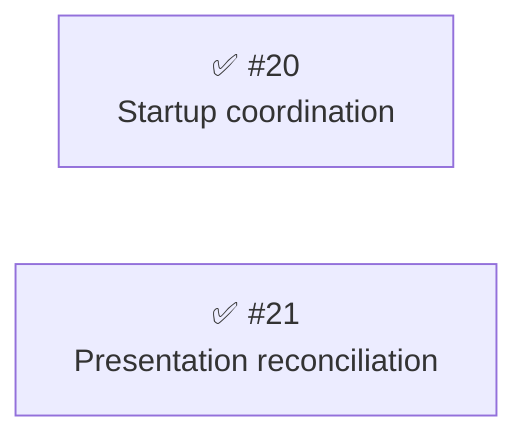

# Phase 23: Upstream integration maintenance

## Completion assessment

The operator accepted the combined maintenance outcome on 2026-09-25 and authorized completion of [#19] and archival of this phase.
Both implementation issues are closed; no abandoned, parked, or follow-on issue was recorded.
The package-labeled issue sweep from 2026-09-24 returned only the two implementation issues already included below.

| Role                  | Issue | Disposition                                        |
| --------------------- | ----- | -------------------------------------------------- |
| Overall objective     | [#19] | Accepted by the operator after combined assessment |
| Startup delivery      | [#20] | Closed; delivered                                  |
| Presentation delivery | [#21] | Closed; delivered                                  |

### Delivered maintenance evidence

| Scenario family                                       | Delivered reduction                                                                                                                                                                                                                                                            | Remaining or relocated obligation                                                                                                                                                                                                                                         |
| ----------------------------------------------------- | ------------------------------------------------------------------------------------------------------------------------------------------------------------------------------------------------------------------------------------------------------------------------------ | ------------------------------------------------------------------------------------------------------------------------------------------------------------------------------------------------------------------------------------------------------------------------- |
| Admission, initial run, termination, disposal, resume | Initial selection owns provider work, cancellation races, startup listeners, and one-shot acknowledgement; `stopQueued()` and `failRun()` match the fixed-upstream method bodies without separate settlement patches; ordinary lifecycle state matches the fixed upstream file | The manager constructs the owner; the record delegates after admission, composes the initial terminal observer, and rechecks the permit after workspace preparation; tools retain selection-only waiting; observer ordering and terminal facts still need semantic review |
| Resource loading, session creation, shutdown          | Existing construction/inheritance behavior is preserved, rather than claiming a new isolation benefit                                                                                                                                                                          | Initialization-time inherited scope capture, scope closure before teardown, cancellation checks before creation and after its await, and disposal before extension binding remain required                                                                                |
| Model-name formula, thinking tags, pending activity   | Ordinary and selected details use one raw-fact producer; synthetic mode-label and thinking-order changes no longer require parsing/reinserting formatted tags; the model formula stays in `spawn-config.ts`; activity precedence has one dispatch point                        | Incoming display fields still need mapping into captured context, the model formula still needs adaptation, and foreground/widget callers must forward private pending activity; owner/observer composition and the bound display closure are new upkeep                  |

This is a bounded reduction in repeated reconciliation, not a prediction of conflict frequency, elapsed maintenance time, or automatic compatibility with future upstream rewrites.
The startup trial used actual fixed-upstream method bodies; the presentation trial used explicitly synthetic changes, not an incoming upstream commit.
The correctly repaired old model-name helper already shared its formula: the delivered gain there is locality, not elimination of two old formulas.
The construction factory was deliberately not restored wholesale to upstream because the final cancellation-before-binding check is necessary.

At archival, source inspection checked the owner, record integration, construction checks, common display producer, and foreground/background/widget paths against both trial reports.
The relevant lifecycle and composition-root source matched the startup delivery, and tools/UI matched the presentation delivery at assessment HEAD `78d6c06336d485d134d2c37e70a4a15984d26e27`.
Current package tests passed: core 86 files / 1,988 tests; selector companion 9 files / 68 tests.
The historical transplant and synthetic trials were not rerun, and no interactive Pi-host or packed-new-core compatibility replay was performed during archival.

### Supporting measurements at completion

These are corroborating measurements, not maintenance-cost acceptance targets.
No numerical improvement was promised; the maintainability decrease is recorded rather than treated as an outcome failure.

| Metric                              | Planning baseline  | Predicted target                 | Delivered      | Recompute                                                                                                                              |
| ----------------------------------- | ------------------ | -------------------------------- | -------------- | -------------------------------------------------------------------------------------------------------------------------------------- |
| Health score                        | 78/B               | No increase promised             | 78/B           | `pnpm fallow health --score --hotspots --targets --workspace @jopqior/pi-subagents`                                                    |
| Maintainability                     | 91.0               | No increase promised             | 90.9           | Same health command                                                                                                                    |
| Average / p90 cyclomatic complexity | 1.3 / 2            | Supporting signal only           | 1.3 / 2        | Same health command                                                                                                                    |
| Dead code                           | No issues          | Review introduced findings       | No issues      | `pnpm fallow dead-code --workspace @jopqior/pi-subagents`                                                                              |
| Production duplication              | No duplication     | No copied display implementation | No duplication | `pnpm fallow dupes --workspace @jopqior/pi-subagents`                                                                                  |
| Source files / LOC                  | Not a phase target | None                             | 73 / 12,121    | `find packages/pi-subagents/src -name '*.ts' -exec wc -l {} +`; file count with `find packages/pi-subagents/src -name '*.ts' \| wc -l` |

The original roadmap follows, with relative links rebased for this archive; its planned acceptance language is historical, superseded by the completion assessment above.

## Findings (planned 2026-09-24)

This fork-maintainer phase serves [#19]: make future incorporation of `gotgenes/pi-packages` updates more mechanical while retaining selector capabilities.
The cause is temporal and representational coupling across the architecture's lifecycle-state, generative-hook, result-delivery, and presentation boundaries.
Selector startup policy and its initial-result milestone participate in upstream lifecycle transitions; selector presentation must reinterpret display facts that upstream computes before selection.
Reducing intrusion into upstream-owned paths is a desired means, but moving the same coupling elsewhere does not establish a maintenance improvement.
Assess the concentration and cohesion of fork additions, not inherited file size as a cleanup target.

The upstream comparison is fixed at `edb35ee28535aac4e12431e47e440f6933911834`; the fork inventory snapshot is `746a4ae812a574d0496cb46c125a32961a608cf1`.
Planning HEAD matches that inventory snapshot.
Do not fetch or replace the upstream baseline during this planning cycle; compare any later local implementation separately.
The full investigation, behavior obligations, historical merge evidence, test limits, and operator decisions live in [the issue checkpoint](../../retro/f0019-upstream-integration-maintenance.md).
Phase planning notes live in [the phase retro](../../retro/phase-23-upstream-integration-maintenance.md).

The operator approved startup coordination and presentation reconciliation as separate deliveries, each carrying its own behavior and maintenance evidence.
Construction/inheritance preservation is included in startup acceptance, not a separate isolation issue.
A probe against the real assembly factory with existing stub IO/session helpers and a synthetic cancellation schedule showed that moving both cancellation checks into an asynchronous IO wrapper permits cancellation between its final check and extension binding.
Retaining the factory's final check prevents that binding; complete restoration of the factory to upstream is therefore not a promised outcome.
No extraction, package boundary, general lifecycle redesign, or generic tag-system rewrite is selected here.

### Supporting baseline

These measurements corroborate the investigation; they are not delivery success criteria or predicted savings.
Fallow was rerun on the unchanged implementation after the disposable probe was removed.

| Metric                              | Baseline       | Phase interpretation                                               | Recompute                                                                           |
| ----------------------------------- | -------------- | ------------------------------------------------------------------ | ----------------------------------------------------------------------------------- |
| Health score                        | 78/B           | Supporting signal, no promised score increase                      | `pnpm fallow health --score --hotspots --targets --workspace @jopqior/pi-subagents` |
| Maintainability                     | 91.0           | Supporting signal, not a maintenance-cost measure                  | Same health command                                                                 |
| Average / p90 cyclomatic complexity | 1.3 / 2        | Supporting signal                                                  | Same health command                                                                 |
| Dead code                           | No issues      | Review any introduced findings                                     | `pnpm fallow dead-code --workspace @jopqior/pi-subagents`                           |
| Production duplication              | No duplication | No copied upstream display implementation as an isolation shortcut | `pnpm fallow dupes --workspace @jopqior/pi-subagents`                               |

Fallow's large callback flags include nested test suites rather than individual giant tests; the prior checkpoint's scout and source inspection did not justify a wholesale test-file split.
The current `subagent.ts` hotspot is accelerating, so the inherited cooling-hotspot cadence premise does not apply.
This phase is triggered by the explicit fork maintenance objective, not by an inherited improvement rotation.
The archived Phase 22 reports no missed targets; its upstream running-child observability and broader cancellation candidates are not adopted into this fork phase.

### Maintenance assessment matrix

The targets are inspectable changes in obligations, not authored duration estimates or conflict-rate promises.
Each implementation plan must choose concrete scenarios, pin affected behavior, and carry the scenario comparison through delivery.
At phase close, replace predictions with the delivered evidence and identify every remaining or relocated obligation.

| Scenario family                                       | Current reconciliation obligation                                                                                           | Required delivery evidence                                                                                                  |
| ----------------------------------------------------- | --------------------------------------------------------------------------------------------------------------------------- | --------------------------------------------------------------------------------------------------------------------------- |
| Admission, initial run, termination, disposal, resume | Reconcile provider work, initial-outcome settlement, startup listener lifetime, and tool return across record/manager/tools | Show which decisions become local or unnecessary, with behavior pins and the remaining lifecycle integration points         |
| Resource loading, session creation, shutdown          | Preserve initialization-time inheritance and final cancellation-before-binding checks                                       | Verify unchanged behavior and explain retained boundaries; removal of all checks is not a target                            |
| Model-name formula, thinking tags, pending activity   | Transfer incoming display rules into the shared fork helper/overlay and keep tool/widget projections consistent             | Show a concrete repeated edit or translation obligation removed or simplified without maintaining a copied renderer/formula |

Reproduce the baseline surfaces from the repository root:

```bash
git diff edb35ee28535aac4e12431e47e440f6933911834 746a4ae812a574d0496cb46c125a32961a608cf1 -- packages/pi-subagents/src/lifecycle/ packages/pi-subagents/src/tools/ packages/pi-subagents/src/ui/ packages/pi-subagents/src/index.ts packages/pi-subagents/src/runtime.ts packages/pi-subagents/src/handlers/lifecycle.ts
git show --remerge-diff 2d8cea699b08afa0f6a2c06eeb1507a52d699636 -- packages/pi-subagents/src/
git show --remerge-diff 0408aa5ff9d9811d98df17dde436e7fd45a5a3ad -- packages/pi-subagents/src/
```

For each delivered step, compare the fixed upstream tree against that step's recorded implementation SHA using the same path scope.
A clean textual merge is not proof of semantic compatibility, and fewer changed files or lines alone cannot satisfy either step.
No new SDK API capability is assumed by this roadmap.

### Open-issue sweep dispositions

- [#19] — retained as the overall objective and final assessment tracker, not a single implementation plan or an extra testing issue.
  Completed child issues, green tests, or a report alone do not close it; assess the delivered maintenance outcome or obtain an explicit defer/stop decision.
- [#20] — filed during [#19]'s planning and adopted as the startup delivery by operator approval.
  Construction and inheritance preservation are included; a standalone construction-isolation candidate was not retained after the boundary probe.
- [#21] — filed during [#19]'s planning and adopted as the presentation delivery by operator approval.
  It has independent acceptance but shares tool call sites with startup work.
- The fork sweep found no other open issue and no open PR before these children were filed.
  Inherited `gotgenes/pi-packages` issues 912, 947, 755, and 949 remain upstream context, not newly deferred fork commitments.
- Keyed presentation tags, generic fixture consolidation, whole-lifecycle reorganization, and broader observer restructuring remain outside the approved scope.
  A subsequent plan must return for approval rather than silently absorbing those deferred directions.

## Steps

Scores below are planning estimates, not measurements of future savings.
Startup has greater behavioral risk; it comes first because it addresses the operator's primary lifecycle concern and lets presentation planning inspect the delivered facts.
The ordering does not establish a hard dependency.

### ✅ [#20] Reduce selector startup coordination with upstream lifecycle changes

**Cause:** fork selection policy, cancellation ownership, and initial-result delivery are entangled with upstream lifecycle transitions.
The concentration of fork-added logic in `Subagent` is a symptom; the maintenance problem is needing to reconcile these obligations across record, manager, tools, and construction paths.

- **Smell:** Category C (temporal coupling and ownership boundaries), with Category B concentration of fork additions as supporting evidence.
- **Target:** `src/lifecycle/subagent.ts`, `subagent-manager.ts`, selection scope/catalogue collaborators, `src/tools/agent-tool.ts`, foreground/background runners, and related construction/runtime/shutdown integration and tests.
- **Constraint:** preserve selector behavior, including background selection-only waiting, synchronous service spawn, no-provider timing, late registration, ignored-abort providers, disposal, inheritance, and resume without reselection.
  Necessary final construction cancellation checks may remain; do not rewrite inherited lifecycle code merely to shrink files.
- **Design questions:** determine a cohesive ownership boundary and identify the concrete upstream scenarios it simplifies without replacing local coupling with adapter upkeep.
  Mechanism and any new module placement belong in this issue's plan.
- **Outcome:** a delivered implementation whose scenario comparison demonstrates removed or simplified selector-specific reasoning or reconciliation, with affected behavior tests and an explicit inventory of residual integration and host-compatibility obligations.
  A relocated block, new helper, smaller diff, or report alone does not satisfy this outcome.
- **Commit type:** non-breaking `refactor:` and `test:` implementation commits.
- **Impact 5 / Risk 4 / Priority 10.**

Landed: `935cdd578b7b1af4da4beceb4707244d74264cb3` implements the selection owner and terminal observer composition; [the fixed-upstream reconciliation trial](../selector-startup-maintenance.md) records the before/after focused results and remaining hooks.

Release: independent

### ✅ [#21] Reduce selector presentation reconciliation with upstream UI changes

**Cause:** ordinary spawn presentation is computed before selection, so the fork must reinterpret model/thinking display and pending activity while tracking upstream display-rule changes.
The handbook's instruction to transfer the model-name formula is a concrete recurring reconciliation obligation.

- **Smell:** Category C (representation coupling across ordinary and selected presentation).
- **Target:** `src/tools/spawn-config.ts`, foreground/background runners, `src/ui/display.ts`, `agent-widget.ts`, `widget-renderer.ts`, and related presentation/real-path tests.
- **Constraint:** retain pending-value suppression, confirmed-pair display, no-provider presentation, unrelated tags/details, and private activity outside public record snapshots.
  Do not copy upstream rendering or broaden into generic UI/tag restructuring.
- **Soft dependency:** inspect [#20]'s delivered pending/selected facts first; existing facts already permit independent acceptance, and no hard implementation dependency has been established.
- **Design questions:** identify which concrete formula, tag, or activity changes can stop requiring repeated edits or manual transfer, and what upstream contracts remain.
  Do not require a new lifecycle model as a premise.
- **Outcome:** a delivered presentation change with a before/after upstream-change scenario demonstrating reduced repetition or translation, affected behavior tests, and explicit residual display/host obligations and abstraction upkeep.
  Fewer touched files without a reduced coordination obligation do not satisfy the outcome.
- **Commit type:** non-breaking `test:`, `refactor:`, and `docs:` commits.
- **Impact 4 / Risk 3 / Priority 12.**

Landed: `1209de69ead8745c3a1b1c4d1d2622380969c527` creates the common producer, and `6705f856952ab2eb3d5d9f50b07c3c4ab2e6956a` centralizes pending activity; [the synthetic reconciliation trial](../selector-presentation-maintenance.md) records scenario differences and remaining adaptations.

Release: independent

## Dependency diagram

The disconnected nodes deliberately show no established hard dependency; the recommended working sequence is the section order above.



## Parallel tracks

- **Track A — Startup coordination:** [#20].
- **Track C — Presentation reconciliation:** [#21].

The tracks are independently assessable, but shared tool call sites make sequential work the recommendation: [#20], then [#21].
Do not infer conflict-free parallel implementation from the absence of a hard dependency.

## Release batches

- Independently releasable: [#20], [#21].
- No joint release batch or release vehicle is selected.
  Each plan settles its commit type and whether its landed work requires a release; refactor/test-only work does not imply an automatic release.
  Publication still requires explicit approval of the fork destination and package scope.

## Overall acceptance and next entry point

Start with `/plan-issue #20`, then `/plan-issue #21` after inspecting the first delivery.
Each issue follows its own planning, implementation, review, and shipping cycle, with behavior verification attached to that delivery.
Keep [#19] open until the operator can assess the combined before/after maintenance evidence, including mechanical merge work, semantic review, retained SDK/host obligations, and new abstraction upkeep.
If a child plan cannot establish benefit within its approved scope, return to [#19] rather than widening the scope or treating investigation alone as completion.

[#19]: https://github.com/Jopqior/gotgenes-pi-packages/issues/19
[#20]: https://github.com/Jopqior/gotgenes-pi-packages/issues/20
[#21]: https://github.com/Jopqior/gotgenes-pi-packages/issues/21
